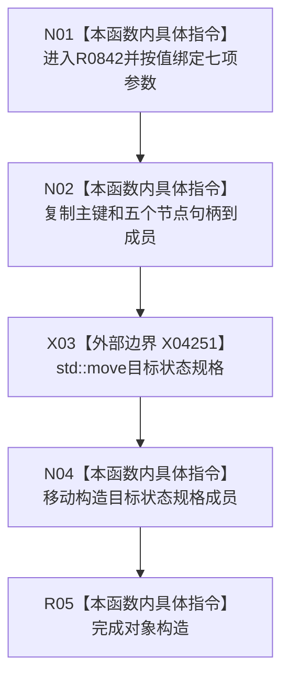

# CF-L10-0130 完整需求写入规格构造现状流程图

图类型：现状流程图
代码版本：`03a8b7ac099ccea83e57f2696e2290b7bcdfacaf`
当前工作区复核基线：`4e0ac10ae3b18404ff2b623faa0fb006fa0fc7a1`
源码 blob：`16ac9534baeda26ac8a712066e713f3339f6e0c8`
覆盖文件：`海中鱼巣/领域/数据操作.需求任务方法.ixx:436-446`
唯一根函数：R0842
完整签名：`海中鱼巣::完整需求写入规格::完整需求写入规格(std::uint64_t 需求主键, 节点句柄 主体, 节点句柄 目标宿主, 节点句柄 场景, 节点句柄 目标特征, 节点句柄 当前特征状态材料, 抽象状态写入规格 目标状态规格)`
参数：需求主键、五个节点句柄和按值目标状态规格
返回结果：构造一个完整需求写入规格对象；无独立返回值
调用图：`流程图/主程序可达调用关系/00_main可达函数身份表.md`、`01_main可达项目调用边表.md`、`02_main可达外部边界表.md`
已登记调用方：R0467
直接项目函数：无
外部边界：X04251
逐行映射表：`流程图/代码流程图/L10/CF-L10-0130_完整需求写入规格构造_逐行代码映射表.md`
不得作为施工许可：是
不得宣称：对象构造证明规格完整或需求已经写入

## 流程图

## 当前边界

- 构造函数不检查完整性，也不访问仓库。
