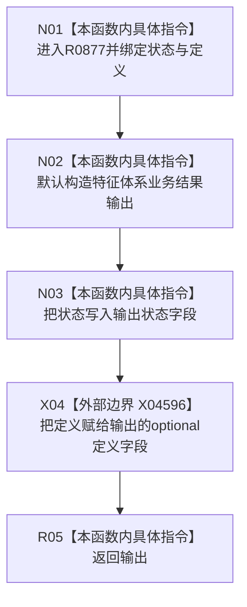

# CF-L10-0131 形成定义结果现状流程图

图类型：现状流程图
代码版本：`03a8b7ac099ccea83e57f2696e2290b7bcdfacaf`
当前工作区复核基线：`00d917a5cf09998d2ab14d9239e1c194b5593ff0`
源码 blob：`a47cd9b07794d30abc6cb9d1df319056105cd596`
覆盖文件：`海中鱼巣/领域/数据操作.特征体系.ixx:1580-1587`
唯一根函数：R0877
完整签名：`海中鱼巣::特征体系业务结果 海中鱼巣::特征体系数据操作::形成定义结果(海中鱼巣::特征体系业务状态 状态, const 海中鱼巣::特征定义值式材料& 定义)`
参数：`状态` 按值；`定义` 为只读借用
返回结果：返回同时携带指定状态和定义副本的特征体系业务结果
调用图：正式 main 可达关系表
已登记调用方：R0876（RCE3239，两处）
直接项目函数：无
外部边界：X04596
逐行映射表：`流程图/代码流程图/L10/CF-L10-0131_形成定义结果_逐行代码映射表.md`
输入契约 / 调用语境表：不适用；本批只维护当前代码图谱
非成功返回二分审查表：不适用；本函数不判断状态
偏差清单：不适用；未在本图裁决规范偏差
依据提交 / 结构化消息：当前正式制图队列与三份 main 可达关系表
验证输出：1580—1587 行逐行覆盖；1 个外部边界可反查
不得作为施工许可：是
不得宣称：结果中携带定义证明定义已持久化或状态与仓库一致

## 流程图

## 当前边界

- 本函数只组装值式结果，不验证状态与定义是否相容，也不访问仓库。
