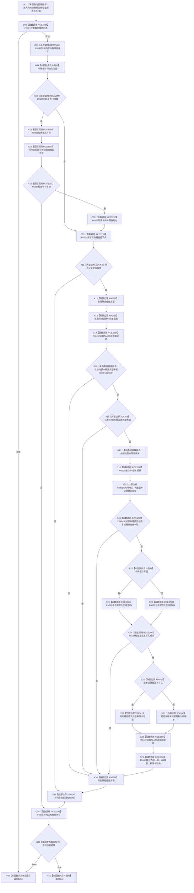

# CF-L10-0132 特征值服务写入 I64 值现状流程图

图类型：现状流程图
代码版本：`03a8b7ac099ccea83e57f2696e2290b7bcdfacaf`
当前工作区复核基线：`00d917a5cf09998d2ab14d9239e1c194b5593ff0`
源码 blob：`be8c82c78253b3bc7d3f4aa15a93660e0025bb06`
覆盖文件：`海中鱼巣/领域/特征值服务.h:212-266`
唯一根函数：R0888
完整签名：`bool 海中鱼巣::特征值服务::写入I64值(节点句柄 特征值节点, std::int64_t 值)`
参数：`特征值节点` 与 `值` 均按值输入；可选事务令牌仅在本次调用和许可生命周期内借用
返回结果：入口、当前原始类型、版本一致性、主信息写入及写后读回均成立时返回 true；任一检查失败返回 false
调用图：正式 main 可达关系表
已登记调用方：R0562（RCE3276）
直接项目函数：F0321（RCE3288）、R0599（RCE3348）、F0336（RCE3289）、F0398（RCE3290）、R0600（RCE3349）、F0338（RCE3291）、F0339（RCE3292）、R0731（RCE3293）、R0732（RCE3294）、R0550（RCE3295）、F0184（RCE3296）、R0010（RCE3297）、F0627（RCE3298）、F0345（RCE3299）
外部边界：X04754、X04755、X04756、X04757、X04758、X04759、X04760、X04761、X04762、X04763
逐行映射表：`流程图/代码流程图/L10/CF-L10-0132_特征值服务写入I64值_逐行代码映射表.md`
不得作为施工许可：是
不得宣称：true 证明上层特征归属、特征状态或跨仓库事务已经发布

## 流程图

## 当前边界

- 接线形态无效时尚未构造许可，直接返回；其余路径按实际已构造对象释放锁、optional 和结构事务许可。
- RCE3348、RCE3349 是本次逐行复核发现并由顶层分配的稳定直接项目边；共享关系表由顶层串行收口。
