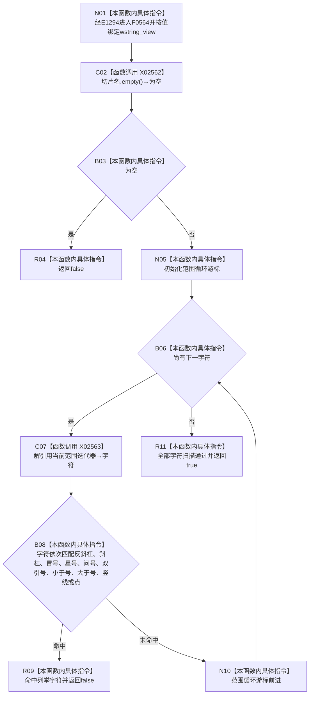

# CF-L11-0001 调试日志切片名可用现状流程图

图类型：现状流程图
代码版本：`14d539ed7ad8af87f35fb0752eed420bbe443316`
源码 blob：`10e98724294f1316bf3ae1bf0266d8334365e033`
覆盖文件：`海中鱼巣/核心/日志系统.h:71-83`
唯一根函数：F0564
完整签名：`bool 海中鱼巣::调试日志切片名可用(std::wstring_view 切片名)`
参数：`切片名` 按值传入；其底层字符序列为调用期间有效的非拥有视图
返回结果：空视图或含 `\ / : * ? " < > | .` 任一字符时返回 false；非空且逐字符扫描均未命中时返回 true
已登记调用方：F0268 经 E1294 调用
直接项目函数：无
外部边界：X02562→`std::wstring_view::empty() const noexcept`；X02563→`std::wstring_view` 范围迭代器解引用取得当前 `wchar_t`
未解析项目调用：0
调用图：`流程图/主程序可达调用关系/01_main可达项目调用边表.md`
逐行映射表：`流程图/代码流程图/L11/CF-L11-0001_调试日志切片名可用_逐行代码映射表.md`
偏差清单：无；本文只冻结当前代码事实
依据提交 / 结构化消息：当前提交、F0564、E1294、X02562、X02563 与源码 71—83 行交叉复核
结构读取与写入：只读切片名字符；不写文件系统、日志或机器结构
逻辑内返回：空切片或命中任一列举字符返回 false；全部字符通过返回 true
内部错误：本函数没有内部错误分支
生命周期与资源释放：不拥有底层字符；范围迭代只在本次调用期间使用
异常：函数体无显式异常处理；已登记边界不引入写入
并发 / 幂等：纯只读判断；相同字符序列重复调用结果相同
验证输出：71—83 行完整映射；1 条项目入边、0 个项目出边、2 个外部边界、0 个未解析调用
不得作为施工许可：是
不得宣称：返回 true 证明文件路径安全、目录可用、日志可写或调试日志已经创建

## 流程图

## 节点合同

| 节点 | 类型 | 输入绑定 | 输出绑定 | 事实读写 | 后继 |
| --- | --- | --- | --- | --- | --- |
| N01 | 本函数内具体指令 | E1294 传入的 `wstring_view` | 进入空值判断 | 无 | C02 |
| C02 / B03 | 函数调用 / 本函数内具体指令 | 切片名 | X02562 的 empty bool | 只读视图长度状态 | true→R04；false→N05 |
| N05 / B06 | 本函数内具体指令 | 切片名范围 | 当前游标与是否结束 | 只读迭代状态 | 有字符→C07；结束→R11 |
| C07 | 函数调用 | 当前范围迭代器 | X02563 取得的 `wchar_t` | 只读当前字符 | B08 |
| B08 | 本函数内具体指令 | 当前字符 | 十项 `||` 左到右短路匹配结果 | 无 | 命中→R09；未命中→N10 |
| N10 | 本函数内具体指令 | 当前游标 | 前进后的游标 | 无 | B06 |
| R04 / R09 / R11 | 本函数内具体指令 | 空、命中或遍历完成条件 | false 或 true | 无 | 结束 |

## 当前边界

- X02562 和 X02563 分别覆盖空值查询与当前字符解引用；范围初始化、结束判断和游标前进按当前函数循环控制指令记账。
- 第 76—78 行是一个由十项 `||` 组成的条件，按 C++ 左到右短路；命中任一列举字符立即返回 false。
- 本函数只判断当前列举字符，不承担路径规范化、保留名判断、目录存在性或写权限校验。
