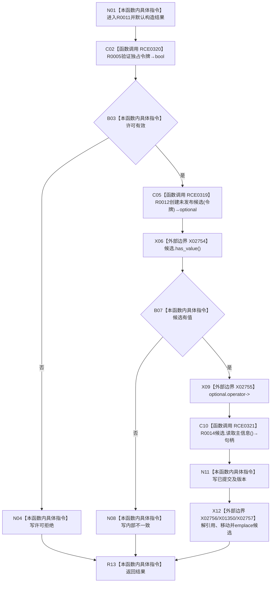

# CF-L11-0002 主信息仓库结构化创建主信息未发布候选现状流程图

图类型：现状流程图
代码版本：`3920a74638264f9f539d50f32f3c9fe5fb1982ab`
源码 blob：`11f8fa53ff961a8cbaac34cf75b69a22533ca907`
覆盖文件：`海中鱼巣/核心/主信息仓库.cpp:62-78`
唯一根函数：R0011
完整签名：`带值结构写入结果<主信息未发布候选> 海中鱼巣::主信息仓库::结构化创建主信息未发布候选(const 结构事务令牌& 令牌)`
参数：令牌为 const 借用；隐式 `this` 为借用
返回结果：许可拒绝、内部不一致或带候选值的已提交结果
已登记调用方：R0021
直接项目函数：RCE0320→R0005；RCE0319→R0012；RCE0321→R0014
外部边界：X01350、X02754—X02757；未解析项目调用：0
调用图：`流程图/主程序可达调用关系/01_main可达项目调用边表.md`
逐行映射表：`流程图/代码流程图/L11/CF-L11-0002_主信息仓库结构化创建主信息未发布候选_逐行代码映射表.md`
偏差清单：无；RCE0319 已去除定义行伪调用点
依据提交 / 结构化消息：当前源码及上述稳定 ID
结构读取与写入：R0012 创建主信息记录；结果 optional 接收候选
逻辑内返回：许可拒绝；候选创建空值映射内部不一致
验证输出：62—78 行完整映射
不得作为施工许可：是
不得宣称：已提交等于候选已发布

## 流程图

## 当前边界

- RCE0319 唯一真实调用点为第 69 行；X01350 精确为候选类型的 `std::move`。
