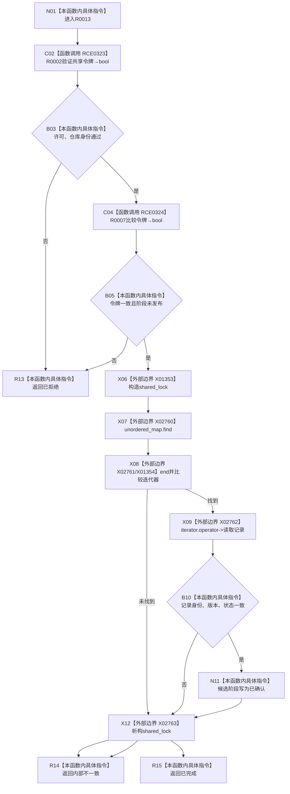

# CF-L11-0003 主信息仓库确认未发布候选现状流程图

图类型：现状流程图
代码版本：`3920a74638264f9f539d50f32f3c9fe5fb1982ab`
源码 blob：`11f8fa53ff961a8cbaac34cf75b69a22533ca907`
覆盖文件：`海中鱼巣/核心/主信息仓库.cpp:90-109`
唯一根函数：R0013
完整签名：`核心未发布候选操作状态 海中鱼巣::主信息仓库::确认未发布候选(主信息未发布候选& 候选, const 结构事务令牌& 令牌)`
参数：候选为可修改借用；令牌为 const 借用；隐式 `this` 为借用
返回结果：已拒绝、内部不一致或已完成
已登记调用方：R0003
直接项目函数：RCE0323→R0002；RCE0324→R0007
外部边界：X01353—X01354、X02760—X02763；未解析项目调用：0
调用图：`流程图/主程序可达调用关系/01_main可达项目调用边表.md`
逐行映射表：`流程图/代码流程图/L11/CF-L11-0003_主信息仓库确认未发布候选_逐行代码映射表.md`
偏差清单：无
依据提交 / 结构化消息：当前源码及上述稳定 ID
结构读取与写入：确认成功时把候选阶段写为已确认
逻辑内返回：入口不匹配返回已拒绝；记录不一致为追根因
验证输出：90—109 行完整映射
不得作为施工许可：是
不得宣称：确认等于向其它仓库发布结构

## 流程图

## 当前边界

- X01354 为 `unordered_map` 迭代器比较，不使用容器内部链表迭代器签名。
