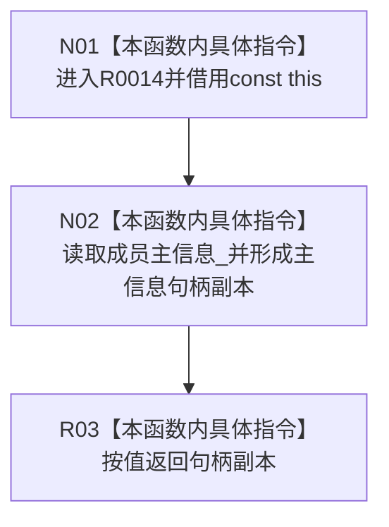

# CF-L11-0004 主信息未发布候选读取主信息现状流程图

图类型：现状流程图
代码版本：`3920a74638264f9f539d50f32f3c9fe5fb1982ab`
源码 blob：`3d8ec1fccd12b1df5b50df8e6d2fe320e5cee800`
覆盖文件：`海中鱼巣/核心/主信息仓库.h:42`
唯一根函数：R0014
完整签名：`海中鱼巣::主信息句柄 海中鱼巣::主信息未发布候选::读取主信息() const`
参数：无显式参数；隐式 const `this` 为调用期间有效的非拥有借用
返回结果：按值复制并返回候选当前保存的 `主信息_` 句柄，不验证句柄、令牌、仓库或候选阶段
已登记调用方：R0003 经 RCE0304；R0006 经 RCE0311；R0011 经 RCE0321；R0021 经 RCE0334；R0036 经 RCE0376
直接项目函数：无
外部边界：无
未解析项目调用：0
调用图：`流程图/主程序可达调用关系/01_main可达项目调用边表.md`
逐行映射表：`流程图/代码流程图/L11/CF-L11-0004_主信息未发布候选读取主信息_逐行代码映射表.md`
偏差清单：无；本函数是未验证的只读访问器
依据提交 / 结构化消息：当前源码、R0014、RCE0304、RCE0311、RCE0321、RCE0334、RCE0376 与稳定函数身份交叉复核
结构读取与写入：只读候选成员 `主信息_`；零机器事实写入
逻辑内返回：不适用；函数无拒绝分支，零句柄也按当前成员值原样返回
内部错误：本函数不判定内部错误；调用方若要求完整候选，必须另行验证
生命周期与资源释放：返回句柄为按值副本，不拥有候选、仓库或主信息记录
异常：句柄为平凡值复制，函数体无显式异常路径
并发 / 幂等：不加锁；调用方负责候选对象并发与生命周期；同一未变候选重复读取结果相同
验证输出：第 42 行完整映射；5 条项目入边、0 条项目出边、0 个外部边界、0 个未解析调用
不得作为施工许可：是
不得宣称：返回非零句柄证明候选完整、令牌有效、记录已发布或对应主信息当前存在

## 流程图

## 节点合同

| 节点 | 类型 | 输入绑定 | 输出绑定 | 事实读写 | 后继 |
| --- | --- | --- | --- | --- | --- |
| N01 | 本函数内具体指令 | 五类已登记调用方提供的 const 候选对象 | const `this` 借用 | 无 | N02 |
| N02 | 本函数内具体指令 | `this->主信息_` | 主信息句柄副本 | 只读候选局部状态 | R03 |
| R03 | 本函数内具体指令 | N02 形成的副本 | `主信息句柄` 返回对象 | 无 | 结束 |

## 当前边界

- R0014 不调用 `句柄有效`，也不读取候选的仓库、令牌或阶段。
- 返回对象脱离候选独立存活，但仍只是旧三元句柄值，不拥有仓库记录。
- 五个调用方分别承担创建后读取、确认、撤销或会话只读语境中的后继判断。
