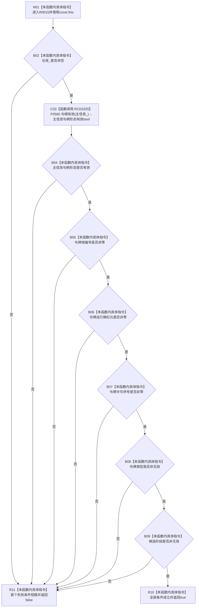

# CF-L11-0005 主信息未发布候选完整现状流程图

图类型：现状流程图
代码版本：`3920a74638264f9f539d50f32f3c9fe5fb1982ab`
源码 blob：`3d8ec1fccd12b1df5b50df8e6d2fe320e5cee800`
覆盖文件：`海中鱼巣/核心/主信息仓库.h:43-47`
唯一根函数：R0015
完整签名：`bool 海中鱼巣::主信息未发布候选::完整() const`
参数：无显式参数；隐式 const `this` 为调用期间有效的非拥有借用
返回结果：仓库指针非空、主信息句柄形态有效、令牌三项编号非零、令牌类型非无效且候选阶段非无效时返回 true；首个失败项按 `&&` 短路返回 false
已登记调用方：R0028 经 RCE0359
直接项目函数：RCE0325→F0565 `句柄有效(const 主信息句柄&)`
外部边界：无
未解析项目调用：0
调用图：`流程图/主程序可达调用关系/01_main可达项目调用边表.md`
逐行映射表：`流程图/代码流程图/L11/CF-L11-0005_主信息未发布候选完整_逐行代码映射表.md`
偏差清单：RCE0325 的旧静态接收者曾误指关系句柄重载 F0168；本图按源码实参类型校正为主信息句柄重载 F0565，不据此形成代码修改
依据提交 / 结构化消息：当前源码、R0015、RCE0359、校正后的 RCE0325、F0565 与句柄重载定义交叉复核
结构读取与写入：只读候选仓库指针、主信息句柄、令牌字段和阶段；零机器事实写入
逻辑内返回：任一完整性组成项不成立时返回 false
内部错误：本函数不区分未初始化、已移动、已撤销或材料损坏；强前置要求完整却返回 false 时由调用方追查候选生命周期
生命周期与资源释放：不保存或转移任何成员；不拥有外部仓库
异常：纯指针、枚举、整数比较及 F0565 值字段判断，无显式异常路径
并发 / 幂等：不加锁；调用方负责候选并发与生命周期；同一未变候选重复判断结果相同
验证输出：43—47 行完整映射；1 条项目入边、1 条项目出边、0 个外部边界、0 个未解析调用
不得作为施工许可：是
不得宣称：返回 true 证明仓库仍存活、令牌当前获许可、记录已发布、阶段允许任意后继操作或候选具备业务完整性

## 流程图

## 项目源码调用合同

| 调用边 | 被调函数 | 实参 / 条件 | 结果 |
| --- | --- | --- | --- |
| RCE0325 | F0565 `bool 句柄有效(const 主信息句柄&)` | `主信息_` 绑定 const 引用；仅 `仓库_ != nullptr` | 主信息句柄三个编号字段均非零的 bool |

## 当前边界

- 第 44—46 行是一个按源码顺序执行的 `&&` 短路链；首个 false 后不再读取后继项。
- F0565 只验证旧三元主信息句柄的形态，不查询仓库记录、版本当前性或发布状态。
- `阶段_ != 无效` 同时接受未发布、已确认和已撤销；R0015 不把阶段进一步区分为具体操作许可。
