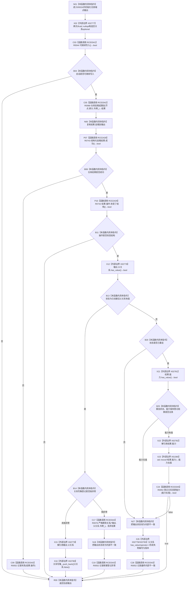

# CF-L11-0006 结构写入会话挂载或重挂节点现状流程图

图类型：现状流程图
代码版本：`0502bcbc13202f97d0d4b4ddefd8476d6deb6c1a`
源码事实提交：`3920a74638264f9f539d50f32f3c9fe5fb1982ab`
源码 blob：`df70de9c299c74f7f0766a3e94facaf504f57968`
覆盖文件：`海中鱼巣/核心/会话.结构写入.ixx:372-414`
唯一根函数：R0024
完整签名：`海中鱼巣::节点挂载结果 海中鱼巣::结构写入会话::挂载或重挂节点(海中鱼巣::节点句柄 节点, 海中鱼巣::节点句柄 新父节点)`
参数：节点和新父节点均按值传入；隐式 `this` 为非拥有借用
返回结果：返回仓库挂载结果；会话不可写时返回初始化的无效端点结果；新建、重挂、无结构变化和内部不一致均以状态区分
已登记调用方：R0418 经 RCE1302
直接项目函数：RCE0341→R0044、RCE0342→R0068、RCE0343→R0052、RCE0344→R0076、RCE0345→R0054、RCE2428→R0743、RCE2429→R0742
外部边界：X01360、X02777—X02783
未解析项目调用：0
逐行映射表：`流程图/代码流程图/L11/CF-L11-0006_结构写入会话挂载或重挂节点_逐行代码映射表.md`
结构读取与写入：仓库可能创建普通父子关系或重挂已发布关系；新建时登记关系写集，重挂时登记关系变更能力；登记失败会转为内部不一致
逻辑内返回：会话不可写、仓库非成功或仓库未改变结构时返回当前挂载结果
内部错误：新建写集登记异常会尝试严格删除；重挂能力缺失或登记失败，以及其它未闭合状态组合，转为内部不一致并记录失败
异常：新建关系写集 `push_back` 异常被捕获；能力登记异常未在本函数捕获
验证输出：372—414 行完整映射；1 条项目入边、7 条项目出边、8 个外部边界
不得作为施工许可：是
不得宣称：内部不一致分支已撤销全部仓库变化，或重挂能力登记失败后关系已恢复

## 流程图

## 当前边界

- RCE0341：`this=this`，返回 bool 被取反用于会话不可写早退。
- RCE0342：`this=&关系_`、`节点=节点`、`新父节点=新父节点`、`令牌=令牌_`，结果绑定局部 `结果`。
- RCE0343：383 行传入 `结果.操作`；394—398 行传入由父关系编号/版本形成的临时内部不一致结果；408—412 行传入由可选父关系形成的临时内部不一致结果，返回均为 void。
- RCE0344：`this=&关系_`、`关系=*输出.父关系`、`令牌=令牌_`，返回值丢弃；仅在新建关系写集登记抛异常时可达。
- RCE0345：`this=this`、`能力=std::move(*结果.能力)`，返回 bool 为重挂成功早退的最后一个短路条件。
- RCE2428：`this=&结果`，返回 bool 被取反用于仓库非成功早退。
- RCE2429：`this=&结果.操作`，返回 bool 被取反用于无结构变化早退。
- X01360 精确实例签名：`海中鱼巣::已发布关系变更能力&& std::move<海中鱼巣::已发布关系变更能力&>(海中鱼巣::已发布关系变更能力&) noexcept`。
- X02777—X02783 依次覆盖空关系 optional 构造、父关系 `has_value`、父关系左值解引用、关系写集 `push_back`、能力 `has_value`、能力左值解引用和父关系 `operator->`。
