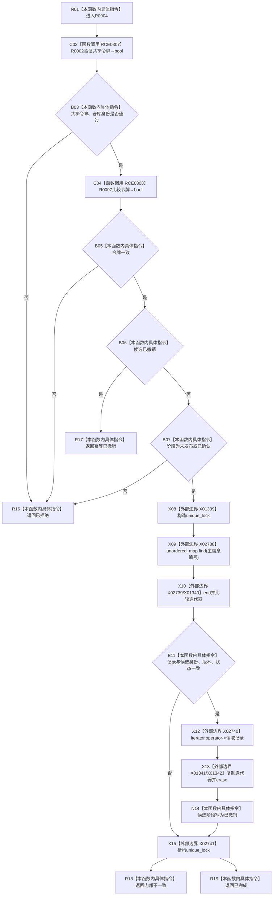

# CF-L11-0007 主信息仓库撤销未发布候选现状流程图

图类型：现状流程图
代码版本：`3920a74638264f9f539d50f32f3c9fe5fb1982ab`
源码 blob：`11f8fa53ff961a8cbaac34cf75b69a22533ca907`
覆盖文件：`海中鱼巣/核心/主信息仓库.cpp:141-167`
唯一根函数：R0004
完整签名：`核心未发布候选操作状态 海中鱼巣::主信息仓库::撤销未发布候选(主信息未发布候选& 候选, const 结构事务令牌& 令牌)`
参数：候选为可修改非拥有借用；令牌为 const 非拥有借用；隐式 `this` 为非拥有借用
返回结果：拒绝、幂等已撤销、内部不一致或已完成
已登记调用方：R0006；R0008 伪边 RCE0315 已删除
直接项目函数：RCE0307→R0002；RCE0308→R0007
外部边界：X01339—X01342、X02738—X02741
未解析项目调用：0
调用图：`流程图/主程序可达调用关系/01_main可达项目调用边表.md`
逐行映射表：`流程图/代码流程图/L11/CF-L11-0007_主信息仓库撤销未发布候选_逐行代码映射表.md`
偏差清单：无；容器类型已冻结为 `unordered_map`
依据提交 / 结构化消息：当前源码、RCE0307—RCE0308、X01339—X01342、X02738—X02741
结构读取与写入：成功时从主信息表擦除记录并把候选阶段写为已撤销
逻辑内返回：入口拒绝及重复撤销；内部不一致为追根因
验证输出：141—167 行完整映射
不得作为施工许可：是
不得宣称：清理其它仓库结构或候选撤销已被全业务验证

## 流程图

## 当前边界

- X01340 是 `unordered_map<uint64_t,主信息记录>::iterator` 比较，不沿用容器内部链表迭代器签名。
