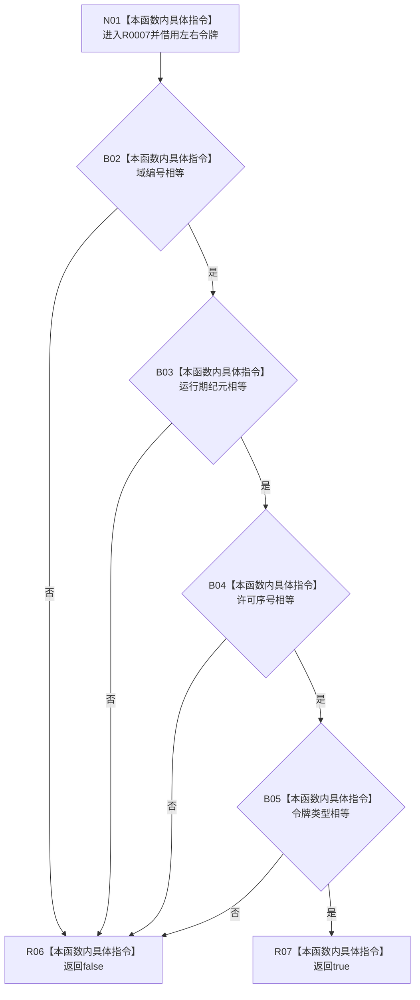

# CF-L11-0008 主信息仓库令牌一致现状流程图

图类型：现状流程图
代码版本：`3920a74638264f9f539d50f32f3c9fe5fb1982ab`
源码 blob：`11f8fa53ff961a8cbaac34cf75b69a22533ca907`
覆盖文件：`海中鱼巣/核心/主信息仓库.cpp:19-22`
唯一根函数：R0007
完整签名：`bool 海中鱼巣::{匿名命名空间@主信息仓库.cpp}::令牌一致(const 结构事务令牌& 左, const 结构事务令牌& 右)`
参数：左右令牌均为 const 非拥有借用
返回结果：域编号、运行期纪元、许可序号和类型全部相等时为 `true`
已登记调用方：R0003、R0004、R0006、R0013
直接项目函数：无；外部边界：无；未解析项目调用：0
调用图：`流程图/主程序可达调用关系/01_main可达项目调用边表.md`
逐行映射表：`流程图/代码流程图/L11/CF-L11-0008_主信息仓库令牌一致_逐行代码映射表.md`
偏差清单：无
依据提交 / 结构化消息：当前源码
结构读取与写入：只读四组令牌字段
逻辑内返回：任一字段不等返回 `false`
验证输出：19—22 行完整映射
不得作为施工许可：是
不得宣称：相等令牌仍处于有效许可期

## 流程图

