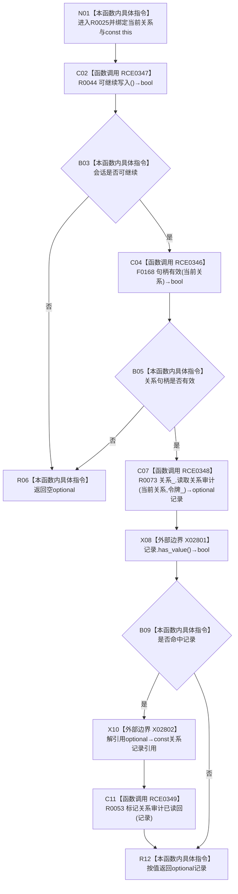

# CF-L11-0009 结构写入会话读取关系审计现状流程图

图类型：现状流程图
代码版本：`3920a74638264f9f539d50f32f3c9fe5fb1982ab`
源码 blob：`df70de9c299c74f7f0766a3e94facaf504f57968`
覆盖文件：`海中鱼巣/核心/会话.结构写入.ixx:416-421`
唯一根函数：R0025
完整签名：`std::optional<海中鱼巣::关系记录> 海中鱼巣::结构写入会话::读取关系审计(海中鱼巣::关系句柄 当前关系) const`
参数：关系句柄按值传入；隐式 const `this` 为调用期间有效的非拥有借用
返回结果：会话不可继续或句柄无效时返回空 optional；否则以会话令牌读取关系审计记录，命中时登记本会话审计读回并返回记录
已登记调用方：R0336 经 RCE1069；R0417 经 RCE1298；R0418 经 RCE1303
直接项目函数：RCE0347→R0044、RCE0346→F0168、RCE0348→R0073、RCE0349→R0053
外部边界：X02801 `optional<关系记录>::has_value()`；X02802 `optional<关系记录>::operator*() const&`
未解析项目调用：0
调用图：`流程图/主程序可达调用关系/01_main可达项目调用边表.md`
逐行映射表：`流程图/代码流程图/L11/CF-L11-0009_结构写入会话读取关系审计_逐行代码映射表.md`
偏差清单：无；局部 optional 的平凡退出生命周期按当前粒度不另列边界
依据提交 / 结构化消息：当前源码、全部入边、RCE0346—RCE0349、X02801—X02802 与稳定函数身份交叉复核
结构读取与写入：只读关系仓库审计记录；命中后 R0053 更新会话内审计读回跟踪，不改关系机器事实
逻辑内返回：会话不可继续、句柄无效或仓库未返回记录时返回空 optional
内部错误：强前置已保证关系存在且可读却返回空时由调用方追查会话、令牌或仓库
生命周期与资源释放：返回 optional 按值拥有记录副本；不保存调用方句柄借用
异常：仓库读取或审计跟踪异常直接传播；本函数不捕获
并发 / 幂等：使用既有会话令牌读取；重复命中可能重复执行会话内读回标记，但不改关系记录
验证输出：416—421 行完整映射；3 条项目入边、4 条项目出边、2 个外部边界、0 个未解析调用
不得作为施工许可：是
不得宣称：返回记录证明其在函数返回后仍为当前值、审计读回已经提交或关系事实被修改

## 流程图

## 调用与边界合同

| 稳定 ID | 输入 / 条件 | 输出 |
| --- | --- | --- |
| RCE0347 | `this`；入口必达 | 会话可继续 bool |
| RCE0346 | `当前关系`；RCE0347=true | 关系句柄形态有效 bool |
| RCE0348 | `this=&关系_`、当前关系、`令牌_` | optional 关系记录 |
| X02801 / X02802 | RCE0348 返回值；仅有值时解引用 | 命中 bool / const 记录引用 |
| RCE0349 | X02802 记录引用；仅命中 | 会话审计读回标记 |

## 当前边界

- 第 417 行按 `||` 短路；会话不可继续时不调用 F0168。
- R0053 只在 optional 有值时调用，空结果原样返回。
- 返回记录是读取副本，不携带会话许可或仓库锁。
