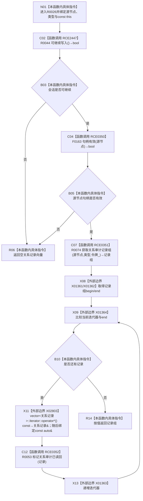

# CF-L11-0010 结构写入会话读取关系审计记录组现状流程图

图类型：现状流程图
代码版本：`3920a74638264f9f539d50f32f3c9fe5fb1982ab`
源码 blob：`df70de9c299c74f7f0766a3e94facaf504f57968`
覆盖文件：`海中鱼巣/核心/会话.结构写入.ixx:423-430`
唯一根函数：R0026
完整签名：`std::vector<海中鱼巣::关系记录> 海中鱼巣::结构写入会话::读取关系审计记录组(海中鱼巣::节点句柄 源节点, 海中鱼巣::关系类型 类型) const`
参数：源节点句柄与关系类型按值传入；隐式 const `this` 为非拥有借用
返回结果：会话不可继续或源节点句柄无效时返回空向量；否则读取审计记录组，逐条标记会话审计读回后按值返回
已登记调用方：R0335 经 RCE1068
直接项目函数：RCE2447→R0044、RCE0350→F0163、RCE0351→R0074、RCE0352→R0053
外部边界：X01361 `begin`、X01362 `end`、X01363 迭代器递增、X01364 迭代器比较、X02803 迭代器解引用
未解析项目调用：0
调用图：`流程图/主程序可达调用关系/01_main可达项目调用边表.md`
逐行映射表：`流程图/代码流程图/L11/CF-L11-0010_结构写入会话读取关系审计记录组_逐行代码映射表.md`
偏差清单：无
依据提交 / 结构化消息：当前源码、RCE1068、RCE0350—RCE0352、RCE2447、X01361—X01364、X02803 交叉复核
结构读取与写入：只读关系审计记录组；逐条更新会话内审计读回跟踪，不改关系记录
逻辑内返回：入口门禁失败或仓库返回空记录组时返回空向量
内部错误：强前置已保证应有记录而返回空时由调用方追查
生命周期与资源释放：局部向量作为返回对象转移或消除复制；循环只借用向量元素
异常：仓库读取、向量操作或 R0053 异常直接传播
并发 / 幂等：使用会话令牌读取；重复调用不改关系事实
验证输出：423—430 行完整映射；1 条项目入边、4 条项目出边、5 个外部边界、0 个未解析调用
不得作为施工许可：是
不得宣称：空向量唯一表示无关系、读回跟踪已经提交或返回记录在函数后持续当前

## 流程图

## 当前边界

- 第 426 行按 `||` 短路；会话不可继续时不调用 F0163。
- R0053 对返回组中的每条记录恰调用一次；组为空时循环体不执行。
- 返回向量按值拥有记录副本，不携带会话令牌。
