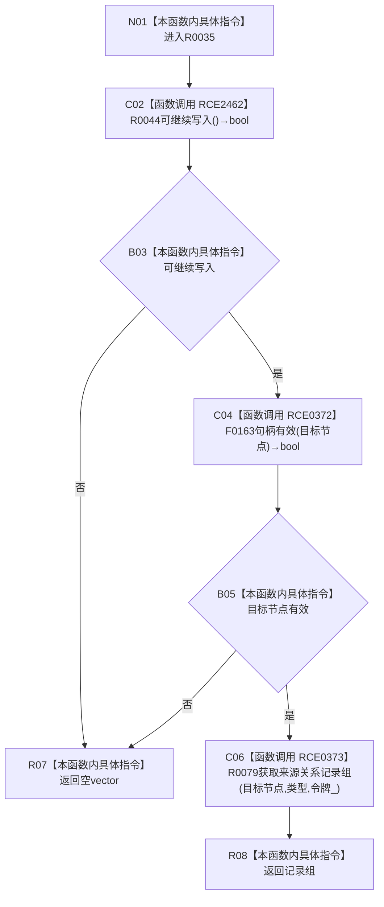

# CF-L11-0012 结构写入会话读取来源关系记录组现状流程图

图类型：现状流程图
代码版本：`3920a74638264f9f539d50f32f3c9fe5fb1982ab`
源码 blob：`df70de9c299c74f7f0766a3e94facaf504f57968`
覆盖文件：`海中鱼巣/核心/会话.结构写入.ixx:551-556`
唯一根函数：R0035
完整签名：`std::vector<关系记录> 海中鱼巣::结构写入会话::读取来源关系记录组(节点句柄 目标节点, 关系类型 类型) const`
参数：目标节点、类型按值；const `this` 为借用
返回结果：入口拒绝为空组，否则返回来源关系记录组
直接项目函数：RCE2462→R0044；RCE0372→F0163；RCE0373→R0079
外部边界：无；未解析调用：0
调用图：`流程图/主程序可达调用关系/01_main可达项目调用边表.md`
逐行映射表：`流程图/代码流程图/L11/CF-L11-0012_结构写入会话读取来源关系记录组_逐行代码映射表.md`
偏差清单：无；依据提交 / 结构化消息：当前源码及三条项目边
结构读取与写入：只读；逻辑内返回：入口拒绝为空组
验证输出：551—556 行完整映射；不得作为施工许可：是
不得宣称：空组唯一证明没有来源关系

## 流程图

