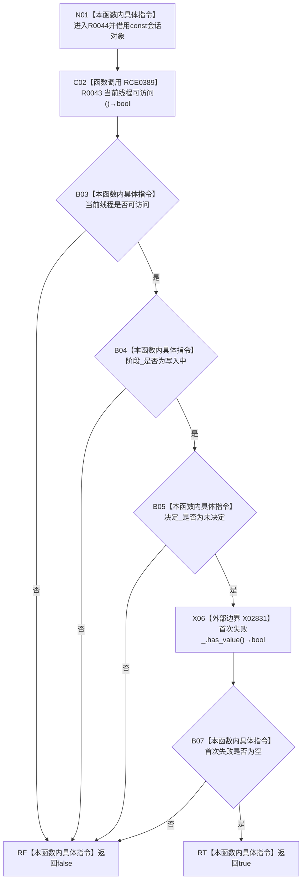

# CF-L11-0013 结构写入会话可继续写入现状流程图

图类型：现状流程图
代码版本：`64a2d63eca4a76b7282f3f8807aa6fea5b0f66a1`
源码事实提交：`3920a74638264f9f539d50f32f3c9fe5fb1982ab`
源码 blob：`df70de9c299c74f7f0766a3e94facaf504f57968`
覆盖文件：`海中鱼巣/核心/会话.结构写入.ixx:732-735`
唯一根函数：R0044
完整签名：`bool 海中鱼巣::结构写入会话::可继续写入() const`
参数：无显式参数；隐式 `this` 为 const 非拥有借用
返回结果：当前线程可访问、阶段为写入中、决定未形成且首次失败为空时返回 true，否则返回 false
已登记调用方：R0021/R0022/R0023/R0024/R0025/R0027/R0032，经 RCE0331/RCE0335/RCE0337/RCE0341/RCE0347/RCE0353/RCE0368
直接项目函数：RCE0389→R0043
外部边界：X02831 `std::optional<结构写入结果>::has_value`
未解析项目调用：0
逐行映射表：`流程图/代码流程图/L11/CF-L11-0013_结构写入会话可继续写入_逐行代码映射表.md`
结构读取与写入：只读线程、阶段、决定与首次失败，零结构变化
验证输出：732—735 行完整映射；7 条项目入边、1 条项目出边、1 个外部边界
不得作为施工许可：是
不得宣称：返回 true 证明任一具体写入必然成功或事务最终提交

## 流程图

## 当前边界

- RCE0389 实参为 `this=this`，返回 bool 是短路合取的第一项，始终在根函数入口调用。
- X02831 实参为 `this=&首次失败_`，返回 bool 被取反形成短路合取的最后一项。
