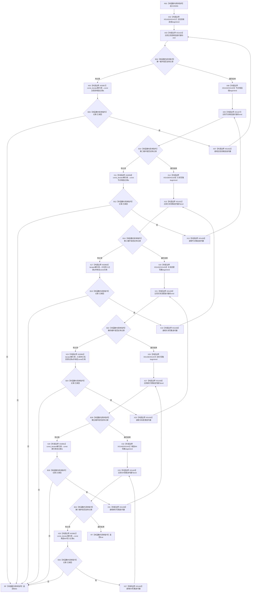

# CF-L11-0014 结构写入会话写集已完整读回现状流程图

图类型：现状流程图
代码版本：`176b674a6c1499ccdd7306f30f910fec6dc5079c`
源码 blob：`df70de9c299c74f7f0766a3e94facaf504f57968`
覆盖文件：`海中鱼巣/核心/会话.结构写入.ixx:830-838`
唯一根函数：R0055
完整签名：`bool 海中鱼巣::结构写入会话::写集已完整读回() const`
参数：无显式参数；const `this` 为借用
返回结果：六个会话写集的每条记录均已读回时返回 true；遇到首条未读回记录立即返回 false
已登记调用方：R0041 经 RCE0388
直接项目函数：无
外部边界：X01420—X01443；X02857—X02862
未解析项目调用：0
调用图：`流程图/主程序可达调用关系/01_main可达项目调用边表.md`
逐行映射表：`流程图/代码流程图/L11/CF-L11-0014_结构写入会话写集已完整读回_逐行代码映射表.md`
偏差清单：无；本文只冻结当前代码事实
结构读取与写入：只读六类写集的 `已读回` 标志，不改变机器结构
逻辑内返回：任一记录未读回时短路返回 false；空写集自然通过
验证输出：830—838 行完整映射；不得作为施工许可：是
不得宣称：返回 true 证明事务已经确认或发布

## 流程图

