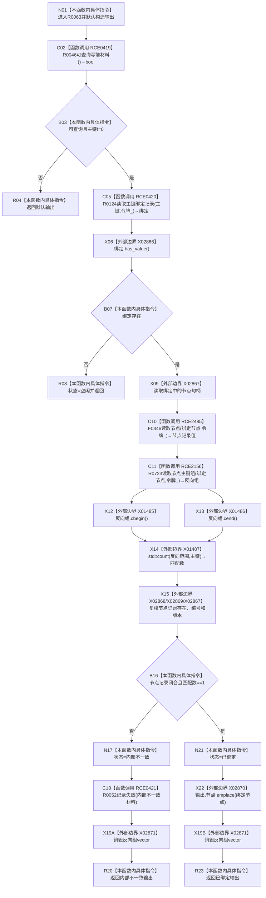

# CF-L11-0015 结构写入会话读取物理主键当前绑定现状流程图

图类型：现状流程图
代码版本：`176b674a6c1499ccdd7306f30f910fec6dc5079c`
源码 blob：`df70de9c299c74f7f0766a3e94facaf504f57968`
覆盖文件：`海中鱼巣/核心/会话.结构写入.ixx:99-119`
唯一根函数：R0063
完整签名：`结构物理主键读取结果 海中鱼巣::结构写入会话::读取物理主键当前绑定(std::uint64_t 主键)`
参数：主键按值；`this` 为可修改借用
返回结果：不可查询 / 主键为零时保留默认结果；未绑定返回空闲；结构不一致返回内部不一致；闭合时返回已绑定与节点句柄
直接项目函数：RCE0419→R0046；RCE0420→R0124；RCE2485→F0346；RCE2156→R0723；RCE0421→R0052
已登记调用方：RCE1061（R0335→R0063）
外部边界：X01485—X01487、X02866—X02871；未解析调用：0
调用图：`流程图/主程序可达调用关系/01_main可达项目调用边表.md`
逐行映射表：`流程图/代码流程图/L11/CF-L11-0015_结构写入会话读取物理主键当前绑定_逐行代码映射表.md`
输入契约 / 调用语境表：本图 B03、B07、B16；非成功返回二分审查表：R04、R08、R20
偏差清单：无；依据提交 / 结构化消息：当前源码、稳定项目边与外部边界
验证输出：99—119 行完整映射；不得作为施工许可：是
不得宣称：索引单向有绑定等于节点记录和反向索引已经闭合

## 流程图

