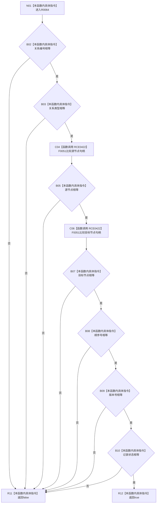

# CF-L11-0016 关系记录一致现状流程图

图类型：现状流程图
代码版本：`176b674a6c1499ccdd7306f30f910fec6dc5079c`
源码 blob：`f7a9ea9a09d3065468208c16f9ea34f806b6e183`
覆盖文件：`海中鱼巣/核心/关系仓库.cpp:102-110`
唯一根函数：R0064
完整签名：`bool 海中鱼巣::{匿名命名空间@关系仓库.cpp}::关系记录一致(const 关系记录& 左, const 关系记录& 右)`
参数：左、右均为只读借用
返回结果：七组字段全部相等时返回 `true`，否则按 `&&` 短路返回 `false`
直接项目函数：RCE0422→F0051（源节点与目标节点两处）；外部边界：无；未解析调用：0
已登记调用方：RCE0441（R0068→R0064）、RCE0454（R0071→R0064）、RCE0461（R0072→R0064）
调用图：`流程图/主程序可达调用关系/01_main可达项目调用边表.md`
逐行映射表：`流程图/代码流程图/L11/CF-L11-0016_关系记录一致_逐行代码映射表.md`
输入契约 / 调用语境表：两个完整关系记录只读比较；非成功返回二分审查表：任一 B 节点→R11
偏差清单：RCE0441 的调用语义按当前源码校正为“新建关系插入成功后比较已插入记录与本地记录”
依据提交 / 结构化消息：当前源码、RCE0422、RCE0441 校正结论
验证输出：102—110 行完整映射；不得作为施工许可：是
不得宣称：返回 `true` 等于关系已发布、端点存在或仓库整体一致

## 流程图

