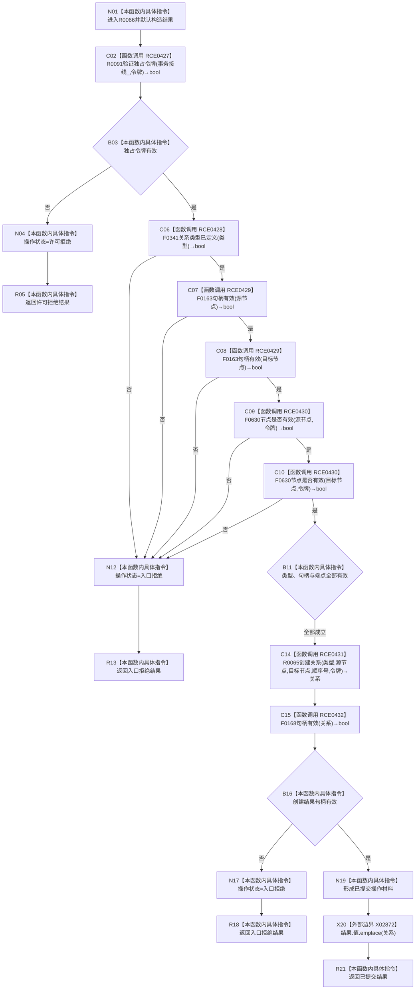

# CF-L11-0017 关系仓库结构化创建关系现状流程图

图类型：现状流程图
代码版本：`176b674a6c1499ccdd7306f30f910fec6dc5079c`
源码 blob：`f7a9ea9a09d3065468208c16f9ea34f806b6e183`
覆盖文件：`海中鱼巣/核心/关系仓库.cpp:1035-1062`
唯一根函数：R0066
完整签名：`带值结构写入结果<关系句柄> 海中鱼巣::关系仓库::结构化创建关系(关系类型 类型, 节点句柄 源节点, 节点句柄 目标节点, std::int64_t 顺序号, const 结构事务令牌& 令牌)`
参数：类型、源节点、目标节点、顺序号按值；令牌为只读借用；`this` 为可修改借用
返回结果：独占令牌无效返回许可拒绝；入口材料无效或创建句柄无效返回入口拒绝；成功返回已提交操作材料与关系句柄
直接项目函数：RCE0427→R0091；RCE0428→F0341；RCE0429→F0163；RCE0430→F0630；RCE0431→R0065；RCE0432→F0168
已登记调用方：RCE0339（R0023→R0066）
外部边界：X02872；未解析调用：0
调用图：`流程图/主程序可达调用关系/01_main可达项目调用边表.md`
逐行映射表：`流程图/代码流程图/L11/CF-L11-0017_关系仓库结构化创建关系_逐行代码映射表.md`
输入契约 / 调用语境表：B03、B11、B16；非成功返回二分审查表：R05、R13、R18
偏差清单：无；依据提交 / 结构化消息：当前源码、RCE0427—RCE0432、X02872
验证输出：1035—1062 行完整映射；不得作为施工许可：是
不得宣称：入口拒绝能够区分所有具体无效字段，或返回已提交等于更大事务已发布

## 流程图

