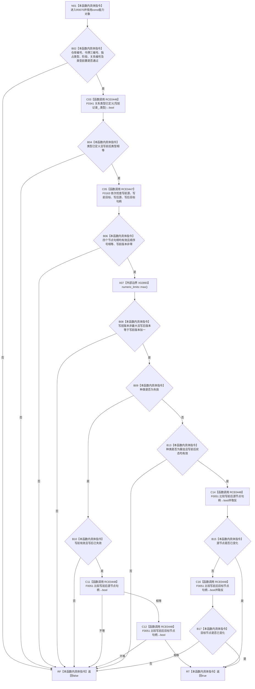

# CF-L11-0018 已发布关系变更能力完整现状流程图

图类型：现状流程图
代码版本：`176b674a6c1499ccdd7306f30f910fec6dc5079c`
源码事实提交：`3920a74638264f9f539d50f32f3c9fe5fb1982ab`
源码 blob：`f7a9ea9a09d3065468208c16f9ea34f806b6e183`
覆盖文件：`海中鱼巣/核心/关系仓库.cpp:127-159`
唯一根函数：R0070
完整签名：`bool 海中鱼巣::已发布关系变更能力::完整() const`
参数：无显式参数；隐式 `this` 为 const 非拥有借用
返回结果：基础身份、令牌、记录版本与种类约束全部成立时返回 true，否则返回 false
已登记调用方：R0071/R0072/R0080/R0084，经 RCE0451/RCE0458/RCE0483/RCE0493
直接项目函数：RCE0446→F0341、RCE0447→F0163、校正后 RCE0448→F0051
外部边界：X02893 `std::numeric_limits<std::uint32_t>::max()`
未解析项目调用：0
逐行映射表：`流程图/代码流程图/L11/CF-L11-0018_已发布关系变更能力完整_逐行代码映射表.md`
结构读取与写入：只读能力对象字段，零结构变化
验证输出：127—159 行完整映射；4 条项目入边、3 条项目出边、1 个外部边界
不得作为施工许可：是

## 流程图

## 当前边界

- RCE0448 已按源码静态类型校正为 F0051；四个调用点都比较节点句柄，不调用 R0064。
- X02893 只读取标准库无符号 32 位最大值，不形成局部资源。
- `!=` 两处由节点句柄相等运算结果取反表达；目标节点比较受源节点未变化的 `||` 短路门控。
