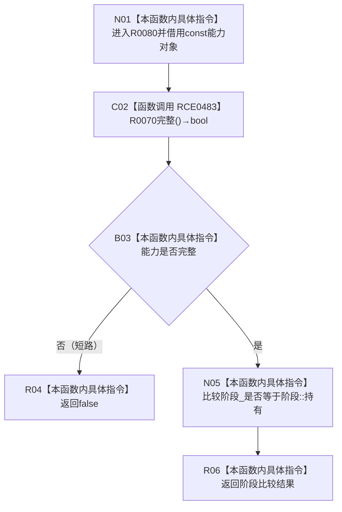

# CF-L11-0019 已发布关系变更能力处于持有阶段现状流程图

图类型：现状流程图
代码版本：`7ad8cf5113162fe92b9f8d43f2b5b9f00d292d1a`
源码事实提交：`3920a74638264f9f539d50f32f3c9fe5fb1982ab`
源码 blob：`f7a9ea9a09d3065468208c16f9ea34f806b6e183`
覆盖文件：`海中鱼巣/核心/关系仓库.cpp:161-163`
唯一根函数：R0080
完整签名：`bool 海中鱼巣::已发布关系变更能力::处于持有阶段() const`
参数：无显式参数；`this` 为 const 非拥有借用
返回结果：能力完整且当前阶段等于持有时返回 true，否则返回 false
已登记调用方：R0068/R0071，经 RCE0443/RCE0453
直接项目函数：RCE0483→R0070
外部边界：无
未解析项目调用：0
逐行映射表：`流程图/代码流程图/L11/CF-L11-0019_已发布关系变更能力处于持有阶段_逐行代码映射表.md`
结构读取与写入：只读能力完整性与阶段字段，零结构变化
验证输出：161—163 行完整映射；2 条项目入边、1 条项目出边、0 个外部边界
不得作为施工许可：是
不得宣称：返回 true 等于外层结构事务已经确认或发布完成

## 流程图

## 当前边界

- `&&` 保持短路语义：能力不完整时不需要用阶段比较改变返回结果。
- 本函数只读能力对象，不确认、不撤销，也不改变关系仓库。
