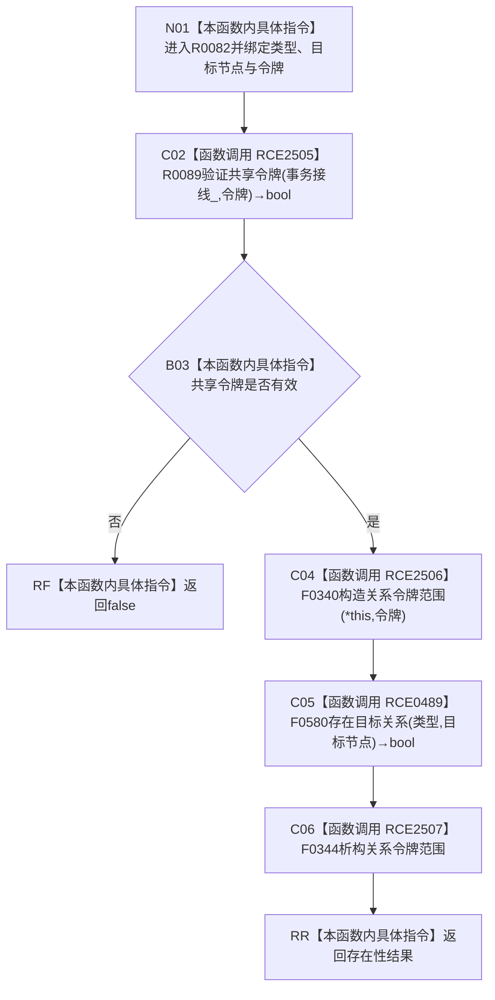

# CF-L11-0020 关系仓库存在目标关系现状流程图

图类型：现状流程图
代码版本：`7ad8cf5113162fe92b9f8d43f2b5b9f00d292d1a`
源码事实提交：`3920a74638264f9f539d50f32f3c9fe5fb1982ab`
源码 blob：`f7a9ea9a09d3065468208c16f9ea34f806b6e183`
覆盖文件：`海中鱼巣/核心/关系仓库.cpp:1643-1646`
唯一根函数：R0082
完整签名：`bool 海中鱼巣::关系仓库::存在目标关系(海中鱼巣::关系类型 类型, 海中鱼巣::节点句柄 目标节点, const 海中鱼巣::结构事务令牌& 令牌) const`
参数：类型和目标节点按值传入；令牌与 const 仓库对象为非拥有借用
返回结果：共享令牌无效时返回 false；有效时返回无令牌重载的存在性结果
已登记调用方：R0396/R0669，经 RCE1249/RCE1998
直接项目函数：RCE2505→R0089、RCE2506→F0340、RCE0489→F0580、RCE2507→F0344
外部边界：无
未解析项目调用：0
逐行映射表：`流程图/代码流程图/L11/CF-L11-0020_关系仓库存在目标关系_逐行代码映射表.md`
结构读取与写入：只建立线程局部关系令牌语境并读取关系存在性，零持久结构变化
验证输出：1643—1646 行完整映射；2 条项目入边、4 条项目出边、0 个外部边界
不得作为施工许可：是
不得宣称：false 能够区分令牌拒绝与合法不存在

## 流程图

## 当前边界

- 令牌拒绝折叠为 false，不产生单独错误对象。
- RCE2507 清理 RCE2506 建立的线程局部令牌语境；本函数不写关系表。
