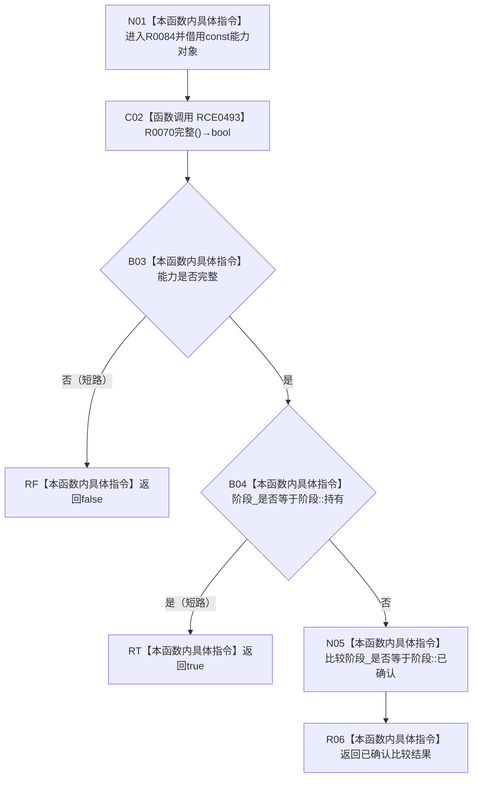

# CF-L11-0021 已发布关系变更能力处于可撤销阶段现状流程图

图类型：现状流程图
代码版本：`7ad8cf5113162fe92b9f8d43f2b5b9f00d292d1a`
源码事实提交：`3920a74638264f9f539d50f32f3c9fe5fb1982ab`
源码 blob：`f7a9ea9a09d3065468208c16f9ea34f806b6e183`
覆盖文件：`海中鱼巣/核心/关系仓库.cpp:165-167`
唯一根函数：R0084
完整签名：`bool 海中鱼巣::已发布关系变更能力::处于可撤销阶段() const`
参数：无显式参数；`this` 为 const 非拥有借用
返回结果：能力完整且阶段为持有或已确认时返回 true，否则返回 false
已登记调用方：R0072，经 RCE0460
直接项目函数：RCE0493→R0070
外部边界：无
未解析项目调用：0
逐行映射表：`流程图/代码流程图/L11/CF-L11-0021_已发布关系变更能力处于可撤销阶段_逐行代码映射表.md`
结构读取与写入：只读能力完整性与阶段字段，零结构变化
验证输出：165—167 行完整映射；1 条项目入边、1 条项目出边、0 个外部边界
不得作为施工许可：是
不得宣称：可撤销判断本身已经执行撤销或改变关系记录

## 流程图

## 当前边界

- 外层 `&&` 和阶段判断内的 `||` 均保持短路语义。
- 本函数只判断当前阶段，不执行确认、撤销或发布。
