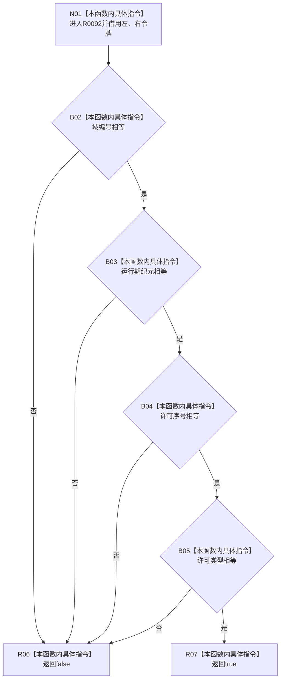

# CF-L11-0023 关系仓库令牌一致现状流程图

图类型：现状流程图
代码版本：`3920a74638264f9f539d50f32f3c9fe5fb1982ab`
源码 blob：`f7a9ea9a09d3065468208c16f9ea34f806b6e183`
覆盖文件：`海中鱼巣/核心/关系仓库.cpp:95-100`
唯一根函数：R0092
完整签名：`bool 海中鱼巣::{匿名命名空间@关系仓库.cpp}::令牌一致(const 海中鱼巣::结构事务令牌& 左, const 海中鱼巣::结构事务令牌& 右)`
参数：`左`、`右` 均为调用期间有效的 const 非拥有借用
返回结果：域编号、运行期纪元、许可序号和许可类型全部相等时返回 `true`，否则按短路比较返回 `false`
已登记调用方：RCE0452、RCE0459
直接项目函数：无
外部边界：无；未解析项目调用：0
调用图：`流程图/主程序可达调用关系/01_main可达项目调用边表.md`
逐行映射表：`流程图/代码流程图/L11/CF-L11-0023_关系仓库令牌一致_逐行代码映射表.md`
偏差清单：无；本函数只比较四个标量字段
依据提交 / 结构化消息：当前源码、RCE0452、RCE0459
结构读取与写入：只读两个令牌；无结构写入
逻辑内返回：任一字段不等时返回 `false`
验证输出：95—100 行完整映射；2 条项目入边、0 条项目出边、0 个外部边界
不得作为施工许可：是
不得宣称：字段相等证明令牌当前仍有效、仍在活动表中或具有独占许可

## 流程图

## 节点合同

| 节点 | 类型 | 输入绑定 | 输出绑定 | 事实读写 | 后继 |
| --- | --- | --- | --- | --- | --- |
| N01 | 本函数内具体指令 | 两个 const 令牌借用 | 当前调用帧 | 无 | B02 |
| B02 | 本函数内具体指令 | 两个域编号 | 相等判断 | 只读令牌 | 否→R06；是→B03 |
| B03 | 本函数内具体指令 | 两个运行期纪元 | 相等判断 | 只读令牌 | 否→R06；是→B04 |
| B04 | 本函数内具体指令 | 两个许可序号 | 相等判断 | 只读令牌 | 否→R06；是→B05 |
| B05 | 本函数内具体指令 | 两个许可类型 | 相等判断 | 只读令牌 | 否→R06；是→R07 |
| R06 / R07 | 本函数内具体指令 | 短路比较结果 | `false` / `true` | 无 | 结束 |

## 当前边界

- 本函数不调用运行期状态验证，也不读取活动许可表。
- 四项比较按 `&&` 从左至右短路。
