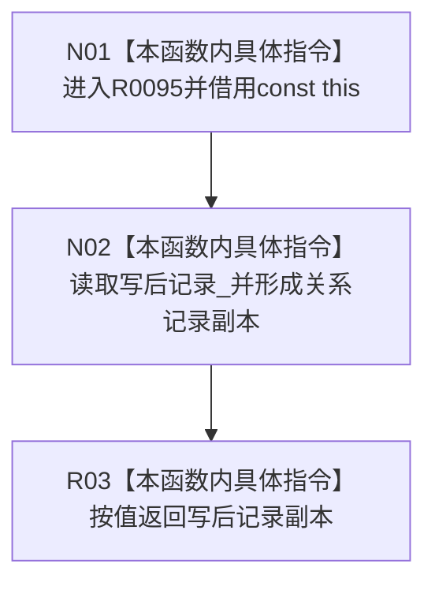

# CF-L11-0025 已发布关系变更能力读取写后记录现状流程图

图类型：现状流程图
代码版本：`3920a74638264f9f539d50f32f3c9fe5fb1982ab`
源码 blob：`0628ee4ade067238e826b26753d806c05b507764`
覆盖文件：`海中鱼巣/核心/关系仓库.h:58`
唯一根函数：R0095
完整签名：`海中鱼巣::关系记录 海中鱼巣::已发布关系变更能力::读取写后记录() const`
参数：无显式参数；隐式 const `this` 为调用期间有效的非拥有借用
返回结果：按值复制并返回能力当前保存的写后关系记录
已登记调用方：RCE0382（R0038，`会话.结构写入.ixx:597`）；RCE0399（R0053，`:807`）；RCE0401（R0054，`:815`）；RCE0449（R0071，`关系仓库.cpp:1368`）；RCE0456（R0072，`:1398`）
直接项目函数：无
外部边界：无；未解析项目调用：0
调用图：`流程图/主程序可达调用关系/01_main可达项目调用边表.md`
逐行映射表：`流程图/代码流程图/L11/CF-L11-0025_已发布关系变更能力读取写后记录_逐行代码映射表.md`
偏差清单：无；本函数不验证能力阶段或记录完整性
依据提交 / 结构化消息：当前源码与上述 5 条稳定项目入边
结构读取与写入：只读成员 `写后记录_`；无结构写入
逻辑内返回：不适用；空值记录也按当前成员值原样返回
生命周期与资源释放：返回按值副本，不取得能力或仓库所有权
验证输出：第 58 行完整映射；5 条项目入边、0 条项目出边、0 个外部边界
不得作为施工许可：是
不得宣称：返回记录证明能力完整、写后记录已发布或仓库当前记录仍匹配

## 流程图

## 当前边界

- 五个调用方分别把返回副本用于会话写集投影、记录一致比较、确认或撤销前读取。
- 本函数不读取仓库、不加锁，也不判断能力阶段。
