# CF-L11-0026 结构写入执行器执行多参与者重载现状流程图

图类型：现状流程图
代码版本：`7ad8cf5113162fe92b9f8d43f2b5b9f00d292d1a`
源码事实提交：`3920a74638264f9f539d50f32f3c9fe5fb1982ab`
源码 blob：`292e602cef1dd658ac2b507a3cc9ced7270a4a86`
覆盖文件：`海中鱼巣/核心/执行器.结构写入.ixx:113-183`
唯一根函数：R0102
完整签名：`结构写入结果 海中鱼巣::结构写入执行器::执行(const std::function<void(结构写入会话&)>& 回调, std::span<结构写入事务参与者* const> 参与者组) const`
参数：`回调` 为 const std::function 借用；`参与者组` 为值式非拥有 span，元素为事务参与者指针
返回结果：入口/许可拒绝、回调或准备/确认失败、撤销结果、内部不一致，或确认成功结果
已登记调用方：R0103，经 RCE0538
直接项目函数：RCE0519→R0104、RCE0520→R0115、校正 RCE0521→F0398、RCE0522→F0338、RCE0523→F0339、RCE2518→R0042、RCE1685→R0391、RCE0524→R0109、RCE0525→R0062、RCE0526→R0108、RCE0527→R0058、RCE0528→R0059、RCE2522→R0056、RCE0529→R0057、RCE0530→R0105、RCE0531→R0107、RCE0532→R0110、RCE2519→R0138、RCE0533→R0060、RCE0534→R0112、RCE0535→R0061、RCE0536→R0113、RCE2520→F0345、RCE2521→R0749
外部边界：X01562/X01563；X02987/X02988/X02989/X02990/X02991
回调登记：RCB0019，R0389 在 `数据操作.特征体系.ixx:885` 注册 R0391，经 R0103 转入本重载第124行调度
未解析项目调用：0
逐行映射表：`流程图/代码流程图/L11/CF-L11-0026_结构写入执行器执行多参与者重载_逐行代码映射表.md`
结构读取与写入：在独占许可内通过结构写入会话和参与者完成准备、确认、发布或逆序撤销；撤销不完整时请求事务域隔离
验证输出：113—183 行完整映射；1 条项目入边、24 条项目出边、7 个当前外部边界、1 项回调登记
不得作为施工许可：是

## 流程图

```mermaid
flowchart TD
    N01["N01【本函数内具体指令】进入R0102并借用回调、接收参与者组span"]
    C02["C02【函数调用 RCE0520】R0115 有效()→bool"]
    C03["C03【函数调用 RCE0519】R0104 有效参与者组(参与者组)→bool"]
    X04["X04【外部调用 X01562】std::function::operator bool()→bool"]
    B05{"B05【本函数内具体指令】执行器、参与者组和回调是否全部有效"}
    RENTRY["RENTRY【本函数内具体指令】返回入口拒绝"]
    C06["C06【函数调用 校正RCE0521】F0398 取得独占许可(运行期状态)→许可"]
    C07["C07【函数调用 RCE0522】F0338 许可.有效()→bool"]
    B08{"B08【本函数内具体指令】许可是否有效"}
    RPERMIT["RPERMIT【本函数内具体指令】返回许可拒绝"]
    C09["C09【函数调用 RCE0523】F0339 许可.读取令牌()→令牌"]
    C10["C10【函数调用 RCE2518】R0042 构造结构写入会话→会话"]
    X11["X11【外部调用 X01563】调用std::function包装器"]
    C12["C12【函数调用 RCE1685 / RCB0019】R0391 回调(会话)"]
    E13{"E13【本函数内具体指令】回调是否抛出异常"}
    CROLL["CROLL【函数调用 RCE0524/RCE0525】逆序撤销参与者并撤销会话"]
    CSUM["CSUM【函数调用 RCE0526】R0108 汇总撤销结果→结果"]
    R14["R14【本函数内具体指令】返回汇总撤销结果"]
    C15["C15【函数调用 RCE0527】R0058 会话.有失败()→bool"]
    B16{"B16【本函数内具体指令】会话是否已有失败"}
    C17["C17【函数调用 RCE0528】R0059 读取首次失败→结果"]
    C18["C18【函数调用 RCE2522】R0056 会话.已请求提交()→bool"]
    B19{"B19【本函数内具体指令】是否请求提交"}
    C20["C20【函数调用 RCE0529】R0057 会话.已请求撤销()→bool"]
    C21["C21【函数调用 RCE0524/RCE0525】逆序撤销参与者并撤销会话"]
    C22["C22【函数调用 RCE0530】R0105 撤销完成(会话撤销)→bool"]
    B23{"B23【本函数内具体指令】参与者和会话撤销是否全部完成"}
    C24["C24【函数调用 RCE0531】R0107 隔离后内部不一致(许可)→结果"]
    R25["R25【本函数内具体指令】显式撤销则返回会话撤销，否则返回入口拒绝"]
    X26["X26【外部调用 X02987/X02988/X02989/X02990/X02991】遍历参与者组用于准备"]
    C27["C27【函数调用 RCE0532】R0110 安全准备参与者(会话,*参与者)→准备结果"]
    C28["C28【函数调用 RCE2519】R0138 准备结果.成功()→bool"]
    B29{"B29【本函数内具体指令】当前参与者准备是否成功"}
    C30["C30【函数调用 RCE0533】R0060 会话.完成确认()→会话确认"]
    C31["C31【函数调用 RCE2519】R0138 会话确认.成功()→bool"]
    B32{"B32【本函数内具体指令】会话确认是否成功"}
    X33["X33【外部调用 X02987/X02988/X02989/X02990/X02991】遍历参与者组用于确认"]
    C34["C34【函数调用 RCE0534】R0112 安全确认参与者(*参与者)→参与者确认"]
    C35["C35【函数调用 RCE2519】R0138 参与者确认.成功()→bool"]
    B36{"B36【本函数内具体指令】当前参与者确认是否成功"}
    C37["C37【函数调用 RCE0535】R0061 会话.完成发布()"]
    X38["X38【外部调用 X02987/X02988/X02989/X02990/X02991】遍历参与者组用于完成发布"]
    C39["C39【函数调用 RCE0536】R0113 完成参与者发布(*参与者)"]
    R40["R40【本函数内具体指令】返回会话确认"]
    D41["D41【函数调用 RCE2521】R0749 析构局部会话"]
    D42["D42【函数调用 RCE2520】F0345 析构局部许可"]
    N01 --> C02 --> C03 --> X04 --> B05
    B05 -- "否" --> RENTRY
    B05 -- "是" --> C06 --> C07 --> B08
    B08 -- "否" --> RPERMIT --> D42
    B08 -- "是" --> C09 --> C10 --> X11 --> C12 --> E13
    E13 -- "是" --> CROLL --> CSUM --> R14 --> D41
    E13 -- "否" --> C15 --> B16
    B16 -- "是" --> C17 --> CROLL
    B16 -- "否" --> C18 --> B19
    B19 -- "否" --> C20 --> C21 --> C22 --> B23
    B23 -- "否" --> C24 --> R14
    B23 -- "是" --> R25 --> D41
    B19 -- "是" --> X26 --> C27 --> C28 --> B29
    B29 -- "否" --> CROLL
    B29 -- "是且仍有参与者" --> X26
    B29 -- "是且准备遍历结束" --> C30 --> C31 --> B32
    B32 -- "否" --> CROLL
    B32 -- "是" --> X33 --> C34 --> C35 --> B36
    B36 -- "否" --> CROLL
    B36 -- "是且仍有参与者" --> X33
    B36 -- "是且确认遍历结束" --> C37 --> X38 --> C39
    C39 -- "仍有参与者" --> X38
    C39 -- "发布遍历结束" --> R40 --> D41
    D41 --> D42
```

## 当前边界

- RCE0521 已从错误的 R0118 校正为生产接线唯一目标 F0398；X01563 是包装器边界，真实项目回调由 RCE1685/RCB0019 绑定 R0391。
- RCE2522 补齐第140行 `会话.已请求提交()` 对 R0056 的直接调用。
- RCE2519 聚合第154、163、172行三个 `结构写入结果::成功()` 调用。
- X02987/X02988/X02989/X02990/X02991 分别登记 span 的 begin、end、解引用、递增和比较，在第152、170、181行三次范围循环复用。
- RCE2521/RCE2520 表达成功构造后的逆序析构：会话先析构，许可后析构；入口拒绝不构造二者，许可拒绝只析构许可。
