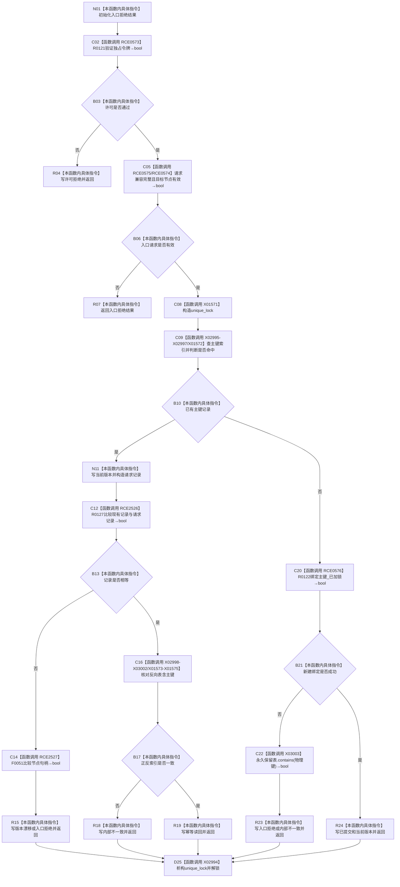

# CF-L11-0027 索引仓库结构化绑定主键请求重载现状流程图

图类型：现状流程图
代码版本：`3920a74638264f9f539d50f32f3c9fe5fb1982ab`
源码 blob：`8874312f67f19b220a08b1397c6103396878513d`
覆盖文件：`海中鱼巣/核心/索引仓库.cpp:127-170`
唯一根函数：R0119
完整签名：`海中鱼巣::结构写入结果 海中鱼巣::索引仓库::结构化绑定主键(const 海中鱼巣::索引绑定请求& 请求, const 海中鱼巣::结构事务令牌& 令牌)`
参数：请求、令牌均为 const 非拥有借用；隐式 `this` 为索引仓库借用
返回结果：许可拒绝、入口拒绝、版本漂移、内部不一致、幂等读回或已提交的结构写入结果
已登记调用方：RCE0355（R0027）
直接项目函数：RCE0573→R0121、RCE0574→F0630、RCE0575→R0128、RCE0576→R0122、RCE2526→R0127、RCE2527→F0051
外部边界：X01571、X01572、X01573、X01574、X01575、X02994、X02995、X02996、X02997、X02998、X02999、X03000、X03001、X03002、X03003
未解析项目调用：0
调用图：`流程图/主程序可达调用关系/01_main可达项目调用边表.md`
逐行映射表：`流程图/代码流程图/L11/CF-L11-0027_索引仓库结构化绑定主键请求重载_逐行代码映射表.md`
结构读取与写入：验证后在仓库独占锁内核对正反索引；新键委托 R0122 写正反索引和永久保留表
逻辑内返回：许可或入口材料拒绝、版本漂移、既有一致记录幂等读回
内部错误：既有正向记录缺少反向键，或 R0122 失败且并非永久保留冲突
验证输出：127—170 行完整映射；1条入边、6条项目出边、15个外部边界
不得作为施工许可：是

当前边界：X02995—X03003 分别补齐两张哈希表、向量查找和锁析构；源码两处 `!=` 分别由 RCE2526、RCE2527 的相等运算重写。
