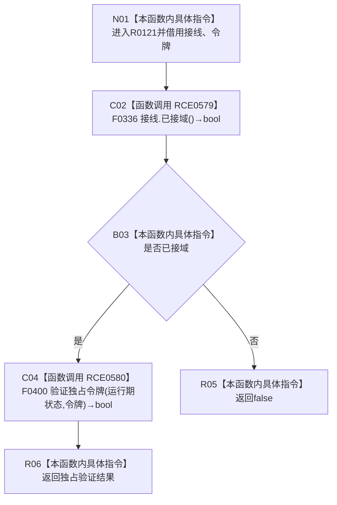

# CF-L11-0028 索引仓库验证独占令牌现状流程图

图类型：现状流程图
代码版本：`3920a74638264f9f539d50f32f3c9fe5fb1982ab`
源码 blob：`8874312f67f19b220a08b1397c6103396878513d`
覆盖文件：`海中鱼巣/核心/索引仓库.cpp:22-24`
唯一根函数：R0121
完整签名：`bool 海中鱼巣::{匿名命名空间@索引仓库.cpp}::验证独占令牌(const 海中鱼巣::结构事务接线& 接线, const 海中鱼巣::结构事务令牌& 令牌)`
参数：接线、令牌均为 const 非拥有借用
返回结果：未接域时短路返回 `false`；已接域时返回独占令牌验证结果
已登记调用方：RCE0573、RCE0586
直接项目函数：RCE0579→F0336；RCE0580→F0400
外部边界：无；未解析项目调用：0
调用图：`流程图/主程序可达调用关系/01_main可达项目调用边表.md`
逐行映射表：`流程图/代码流程图/L11/CF-L11-0028_索引仓库验证独占令牌_逐行代码映射表.md`
结构读取与写入：只读接线和令牌；无写入
验证输出：22—24 行完整映射；不得作为施工许可：是

当前边界：RCE0580 只在 RCE0579 为真时调用；本图不展开 F0400。
