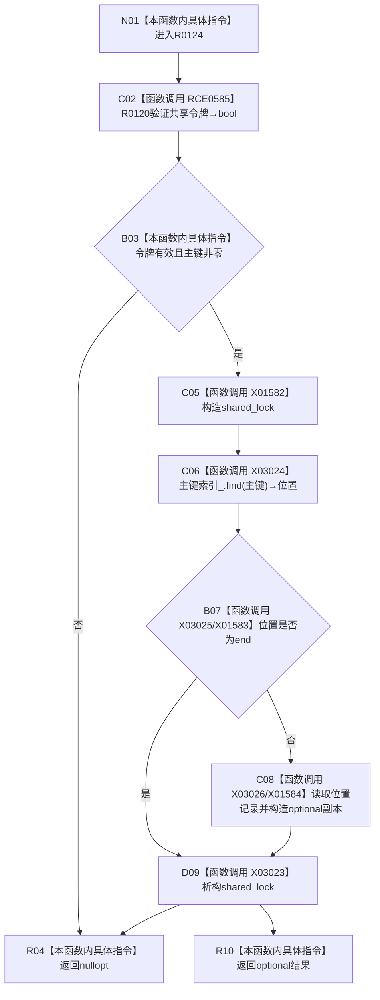

# CF-L11-0029 索引仓库读取主键绑定记录现状流程图

图类型：现状流程图
代码版本：`3920a74638264f9f539d50f32f3c9fe5fb1982ab`
源码 blob：`8874312f67f19b220a08b1397c6103396878513d`
覆盖文件：`海中鱼巣/核心/索引仓库.cpp:304-312`
唯一根函数：R0124
完整签名：`std::optional<海中鱼巣::主键绑定记录> 海中鱼巣::索引仓库::读取主键绑定记录(std::uint64_t 主键, const 海中鱼巣::结构事务令牌& 令牌) const`
参数：主键按值；令牌为 const 非拥有借用
返回结果：入口拒绝或未命中返回 `nullopt`；命中返回绑定记录值副本
已登记调用方：RCE0385、RCE0420、RCE1841
直接项目函数：RCE0585→R0120
外部边界：X01582、X01583、X01584、X03023、X03024、X03025、X03026
未解析项目调用：0
调用图：`流程图/主程序可达调用关系/01_main可达项目调用边表.md`
逐行映射表：`流程图/代码流程图/L11/CF-L11-0029_索引仓库读取主键绑定记录_逐行代码映射表.md`
验证输出：304—312 行完整映射；不得作为施工许可：是

当前边界：共享锁覆盖查找、末端比较和记录复制，返回前释放。
