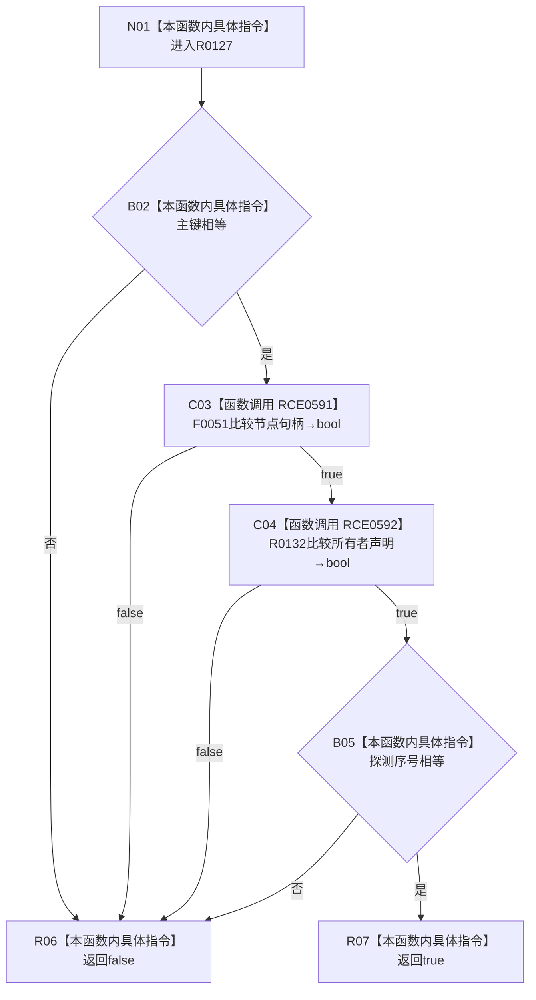

# CF-L11-0030 主键绑定记录相等运算符现状流程图

图类型：现状流程图
代码版本：`3920a74638264f9f539d50f32f3c9fe5fb1982ab`
源码 blob：`8701baa8409c6a8969ceb9055b0f7a7aa6604b30`
覆盖文件：`海中鱼巣/核心/索引仓库.h:51-54`
唯一根函数：R0127
完整签名：`bool 海中鱼巣::operator==(const 海中鱼巣::主键绑定记录& 左, const 海中鱼巣::主键绑定记录& 右) noexcept`
参数：左右记录均为 const 非拥有借用
返回结果：主键、节点、所有者声明和探测序号全部相等时为 `true`
已登记调用方：RCE0581、RCE1842、RCE2469、RCE2526
直接项目函数：RCE0591→F0051；RCE0592→R0132
外部边界：无；未解析项目调用：0
调用图：`流程图/主程序可达调用关系/01_main可达项目调用边表.md`
逐行映射表：`流程图/代码流程图/L11/CF-L11-0030_主键绑定记录相等运算符_逐行代码映射表.md`
验证输出：51—54 行完整映射；不得作为施工许可：是

当前边界：比较按 `&&` 短路；相等不证明记录仍存在于索引。
