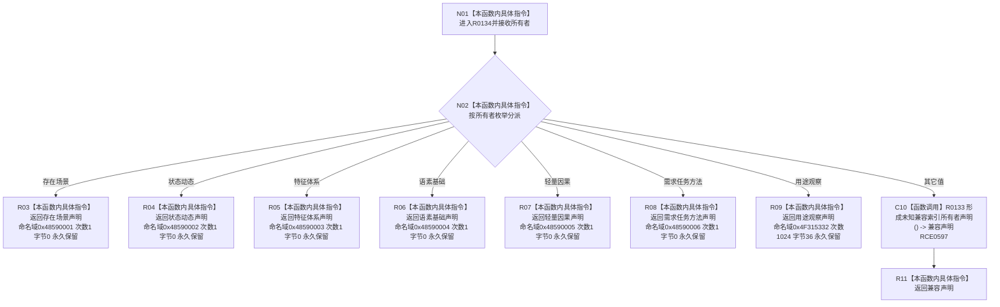

# CF-L11-0031 形成索引所有者声明现状流程图

图类型：现状流程图
代码版本：`73cc1af758e041519fa27c1dd57b9d5d07e3405a`
源码 blob：`ecdd8b7888aeda86fce1ba8bc02e40b5cfa282aa`
覆盖文件：`海中鱼巣/核心/索引所有权.数据.h:66-85`
唯一根函数：R0134
完整签名：`inline constexpr 海中鱼巣::索引所有者声明 海中鱼巣::形成索引所有者声明(海中鱼巣::索引所有者 所有者) noexcept`
参数：`所有者` 按值传入，用于选择七个显式所有者合同之一或默认兼容合同
返回结果：按值返回与所有者对应的七字段索引所有者声明
已登记调用方：RCE0596（R0129，`索引所有权.数据.h:119`）、RCE0600（R0135，`索引所有权.数据.h:88`）
直接项目函数：RCE0597 → R0133 `形成未知兼容索引所有者声明()`（仅默认分支）
被调函数流程图：`流程图/代码流程图/L12/CF-L12-0020_形成未知兼容索引所有者声明_现状流程图.md`
外部边界：无；未解析项目调用：0
调用图：`流程图/主程序可达调用关系/01_main可达项目调用边表.md`
逐行映射表：`流程图/代码流程图/L11/CF-L11-0031_形成索引所有者声明_逐行代码映射表.md`
偏差清单：无
依据提交 / 结构化消息：当前源码、RCE0596、RCE0597、RCE0600
结构读取与写入：只读值参数并形成返回值；不写仓库或持久结构
逻辑内返回：未匹配七个显式枚举值时返回未知兼容声明
生命周期与资源释放：返回平凡值对象
异常：函数声明 `noexcept`
验证输出：66—85 行完整映射；2 条项目入边、1 条项目出边、0 个外部边界
不得作为施工许可：是
不得宣称：返回声明证明调用方已经完成绑定或规范复核

## 流程图

## 当前边界

- 七个显式分支均原样携带输入所有者；前三个版本字段均为一，键保留策略均为删除后永久保留。
- 用途观察分支是唯一使用最大探测次数 `1024` 和规范身份字节数 `36` 的显式分支。
- 默认分支通过 RCE0597 调用 R0133，不在本图展开其内部字段构造过程。
