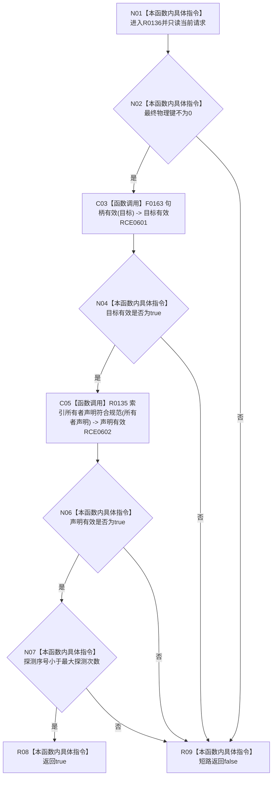

# CF-L11-0032 索引绑定请求显式完整现状流程图

图类型：现状流程图
代码版本：`73cc1af758e041519fa27c1dd57b9d5d07e3405a`
源码 blob：`ecdd8b7888aeda86fce1ba8bc02e40b5cfa282aa`
覆盖文件：`海中鱼巣/核心/索引所有权.数据.h:97-100`
唯一根函数：R0136
完整签名：`bool 海中鱼巣::索引绑定请求::显式完整() const noexcept`
参数：无显式参数；只读 `this` 指向的索引绑定请求
返回结果：最终物理键、目标句柄、所有者声明和探测序号四项合同全部成立时返回 `true`，否则返回 `false`
已登记调用方：RCE0354（R0027，`会话.结构写入.ixx:452`）、RCE0384（R0040，`会话.结构写入.ixx:633`）
直接项目函数：RCE0601 → F0163 `句柄有效(目标)`；RCE0602 → R0135 `索引所有者声明符合规范(所有者声明)`
被调函数流程图：`流程图/代码流程图/L5/CF-L5-0044_节点句柄有效_现状流程图.md`；`流程图/代码流程图/L12/CF-L12-0021_索引所有者声明符合规范_现状流程图.md`
外部边界：无；未解析项目调用：0
调用图：`流程图/主程序可达调用关系/01_main可达项目调用边表.md`
逐行映射表：`流程图/代码流程图/L11/CF-L11-0032_索引绑定请求显式完整_逐行代码映射表.md`
偏差清单：无
依据提交 / 结构化消息：当前源码、RCE0354、RCE0384、RCE0601、RCE0602
结构读取与写入：只读请求字段及目标句柄；不写结构
逻辑内返回：任一请求完整性条件不成立时返回 `false`
生命周期与资源释放：不取得资源
异常：函数声明 `noexcept`
验证输出：97—100 行完整映射；2 条项目入边、2 条项目出边、0 个外部边界
不得作为施工许可：是
不得宣称：返回 `true` 证明索引绑定已经执行或成功

## 流程图

## 当前边界

- `&&` 按物理键、目标句柄、所有者声明、探测序号的顺序短路。
- 本函数仅验证请求材料，不执行任何索引读写。
