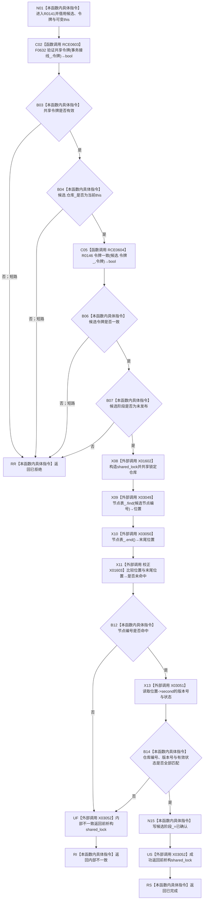

# CF-L11-0033 节点仓库确认未发布候选现状流程图

图类型：现状流程图
代码版本：`010784a906e8283644a63a742151f6457a847c38`
源码事实提交：`3920a74638264f9f539d50f32f3c9fe5fb1982ab`
源码 blob：`f38b979a3f7cefd182a50e0b687c5a6fffebc91c`
覆盖文件：`海中鱼巣/核心/节点仓库.cpp:125-144`
唯一根函数：R0141
完整签名：`海中鱼巣::核心未发布候选操作状态 海中鱼巣::节点仓库::确认未发布候选(海中鱼巣::节点未发布候选& 候选, const 海中鱼巣::结构事务令牌& 令牌)`
参数：`候选` 为调用期间有效的非拥有可写引用；`令牌` 为 const 非拥有借用；隐式 `this` 为可变节点仓库借用
返回结果：入口合同不匹配时返回 `已拒绝`；仓库记录不一致时返回 `内部不一致`；确认候选阶段后返回 `已完成`
已登记调用方：R0142，经校正后 RCE0605（真实调用点仅 `节点仓库.cpp:167`）
直接项目函数：RCE0603→F0632；RCE0604→R0146
外部边界：X01602 shared_lock构造；X03049 unordered_map::find；X03050 unordered_map::end；校正 X01603 unordered_map迭代器相等比较；X03051 unordered_map迭代器operator->；X03052 shared_lock析构
未解析项目调用：0
调用图：`流程图/主程序可达调用关系/01_main可达项目调用边表.md`
逐行映射表：`流程图/代码流程图/L11/CF-L11-0033_节点仓库确认未发布候选_逐行代码映射表.md`
结构读取与写入：共享锁内只读节点表记录；成功时把候选阶段改为 `已确认`，不修改节点记录
验证输出：125—144 行完整映射；1 条项目入边、2 条项目出边、6 个当前外部边界
不得作为施工许可：是
不得宣称：返回 `已完成` 证明候选已经发布或节点记录已发生版本变化

## 流程图

## 当前边界

- RCE0605 的定义行误归属已移除，当前调用方只在第167行调用本函数。
- X01603 已按 `节点表_` 的真实 `std::unordered_map<std::uint64_t,节点记录>::iterator` 静态类型校正，不再使用旧 `_List_const_iterator` 签名。
- X03052 覆盖共享锁成功构造后的内部不一致、正常返回及异常展开；入口拒绝发生在锁构造前。
