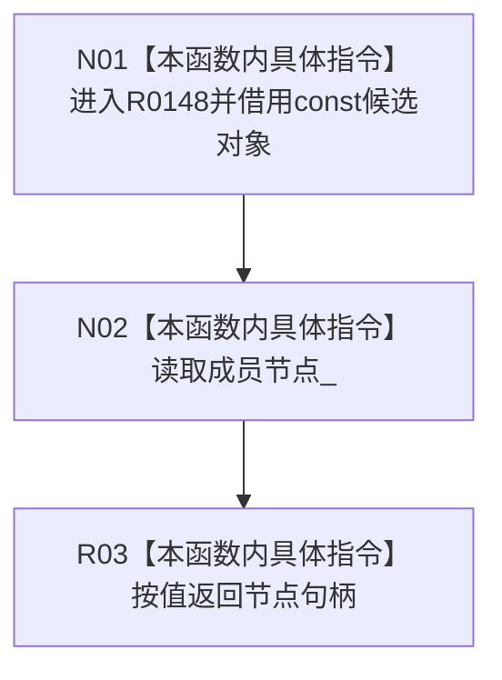

# CF-L11-0034 节点未发布候选读取节点现状流程图

图类型：现状流程图
代码版本：`010784a906e8283644a63a742151f6457a847c38`
源码事实提交：`3920a74638264f9f539d50f32f3c9fe5fb1982ab`
源码 blob：`9f8ef9a14937b13af5f31f9c8fc3457dd0078ead`
覆盖文件：`海中鱼巣/核心/节点仓库.h:38`
唯一根函数：R0148
完整签名：`海中鱼巣::节点句柄 海中鱼巣::节点未发布候选::读取节点() const`
参数：无显式参数；隐式 const `this` 为候选对象的非拥有借用
返回结果：按值返回候选当前保存的 `节点_` 句柄
已登记调用方：R0022/R0037/R0048/R0142/R0144/R0745，经 RCE2423/RCE2466/RCE2477/RCE0606/RCE0612/RCE2443
直接项目函数：无
外部边界：无
未解析项目调用：0
逐行映射表：`流程图/代码流程图/L11/CF-L11-0034_节点未发布候选读取节点_逐行代码映射表.md`
结构读取与写入：只读候选成员，不改变候选、节点表或句柄
验证输出：第38行完整映射；6 条项目入边、0 条项目出边、0 个外部边界
不得作为施工许可：是
不得宣称：返回的句柄当前有效、已确认或已发布

## 流程图

## 当前边界

- 本函数不调用句柄有效性检查，只复制当前保存的值。
- 候选阶段、令牌和仓库指针均不参与本次读取。
