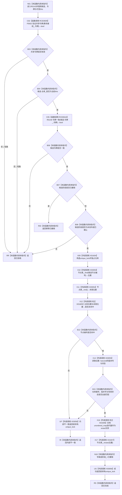

# CF-L11-0035 节点仓库撤销未发布候选现状流程图

图类型：现状流程图
代码版本：`010784a906e8283644a63a742151f6457a847c38`
源码事实提交：`3920a74638264f9f539d50f32f3c9fe5fb1982ab`
源码 blob：`f38b979a3f7cefd182a50e0b687c5a6fffebc91c`
覆盖文件：`海中鱼巣/核心/节点仓库.cpp:176-202`
唯一根函数：R0143
完整签名：`海中鱼巣::核心未发布候选操作状态 海中鱼巣::节点仓库::撤销未发布候选(海中鱼巣::节点未发布候选& 候选, const 海中鱼巣::结构事务令牌& 令牌)`
参数：`候选` 为非拥有可写引用；`令牌` 为 const 非拥有借用；隐式 `this` 为可变节点仓库借用
返回结果：返回已拒绝、幂等已撤销、内部不一致或已完成
已登记调用方：R0144，经校正后 RCE0611（真实调用点仅 `节点仓库.cpp:221`）；RCE0617 已删除
直接项目函数：RCE0609→F0632；RCE0610→R0146
外部边界：X01604 unique_lock构造；X03053 unordered_map::find；X03054 unordered_map::end；校正 X01605 unordered_map迭代器相等比较；X03055 unordered_map迭代器operator->；校正 X01606 unordered_map迭代器复制；X01607 unordered_map::erase；X03056 unique_lock析构
未解析项目调用：0
逐行映射表：`流程图/代码流程图/L11/CF-L11-0035_节点仓库撤销未发布候选_逐行代码映射表.md`
结构读取与写入：独占锁内物理擦除节点表记录，并把候选阶段改为 `已撤销`
验证输出：176—202 行完整映射；1 条项目入边、2 条项目出边、8 个当前外部边界
不得作为施工许可：是
不得宣称：撤销已完成证明所有其它仓库候选或引用关系也已撤销

## 流程图

## 当前边界

- RCE0617 的第351行实际是 R0145 令牌验证调用，已从当前边删除；R0143 的唯一真实项目调用方为 R0144 第221行，因此当前最短深度校正为 L11。
- X01605/X01606 均按 `std::unordered_map<std::uint64_t,节点记录>::iterator` 校正，不再沿用旧 list 迭代器签名。
- X03056 覆盖 unique_lock 成功构造后的内部不一致、正常返回及异常展开；前三类入口拒绝发生在锁构造前。
