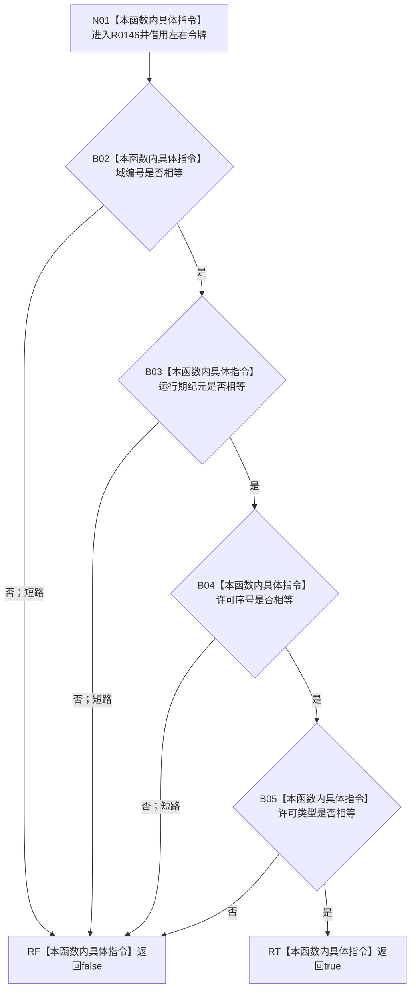

# CF-L11-0036 节点仓库令牌一致现状流程图

图类型：现状流程图
代码版本：`010784a906e8283644a63a742151f6457a847c38`
源码事实提交：`3920a74638264f9f539d50f32f3c9fe5fb1982ab`
源码 blob：`f38b979a3f7cefd182a50e0b687c5a6fffebc91c`
覆盖文件：`海中鱼巣/核心/节点仓库.cpp:31-34`
唯一根函数：R0146
完整签名：`bool 海中鱼巣::{匿名命名空间@节点仓库.cpp}::令牌一致(const 海中鱼巣::结构事务令牌& 左, const 海中鱼巣::结构事务令牌& 右)`
参数：`左`、`右` 均为调用期间有效的 const 非拥有令牌借用
返回结果：域编号、运行期纪元、许可序号和许可类型全部相等时返回 true，否则按 `&&` 短路返回 false
已登记调用方：R0141/R0142/R0143/R0144，经 RCE0604/RCE0608/RCE0610/RCE0614
直接项目函数：无
外部边界：无
未解析项目调用：0
逐行映射表：`流程图/代码流程图/L11/CF-L11-0036_节点仓库令牌一致_逐行代码映射表.md`
结构读取与写入：只读两个令牌的四个标量字段
验证输出：31—34 行完整映射；4 条项目入边、0 条项目出边、0 个外部边界
不得作为施工许可：是
不得宣称：字段一致证明令牌当前仍有效或具备某类仓库操作许可

## 流程图

## 当前边界

- R0146 不调用令牌验证接线，只比较四个值字段。
- RCE0617 删除后 R0143 不再处于 L6；四个真实调用方的最短前驱使 R0146 深度校正为 L11。
