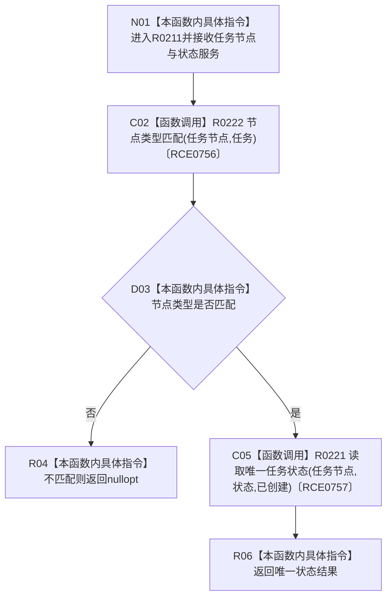

# CF-L11-0041 读取任务创建状态现状流程图

图类型：现状流程图
代码版本：`3920a74638264f9f539d50f32f3c9fe5fb1982ab`
源码 blob：`24161aaaf7138004380b42b37882149e7ff3a087`
覆盖文件：`海中鱼巣/领域/任务服务.h:441-446`
唯一根函数：R0211
完整签名：`std::optional<海中鱼巣::节点句柄> 海中鱼巣::任务服务::读取任务创建状态(海中鱼巣::节点句柄 任务节点, const 海中鱼巣::状态服务& 状态) const`
参数：任务节点按值传入；状态服务以 const 引用借用
返回结果：节点不是任务时返回 `nullopt`；否则返回唯一已创建状态
已登记调用方：RCE0944（R0288）
直接项目函数：R0222（RCE0756）、R0221（RCE0757）
外部边界：无；未解析项目调用：0
调用图：`流程图/主程序可达调用关系/01_main可达项目调用边表.md`
逐行映射表：`流程图/代码流程图/L11/CF-L11-0041_读取任务创建状态_逐行代码映射表.md`
偏差清单：无
依据：RCE0944、RCE0756、RCE0757 与当前源码
结构读取与写入：只读节点类型、关系和状态值
逻辑内返回：节点类型不匹配时返回空 optional
不得作为施工许可：是
不得宣称：存在创建状态节点证明任务正在执行

## 流程图

## 当前边界

- 只读查询，不创建状态节点或写状态值。
