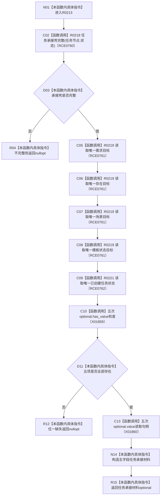

# CF-L11-0043 读取任务承接材料现状流程图

图类型：现状流程图
代码版本：`3920a74638264f9f539d50f32f3c9fe5fb1982ab`
源码 blob：`24161aaaf7138004380b42b37882149e7ff3a087`
覆盖文件：`海中鱼巣/领域/任务服务.h:455-478`
唯一根函数：R0213
完整签名：`std::optional<海中鱼巣::任务承接材料> 海中鱼巣::任务服务::读取任务承接材料(海中鱼巣::节点句柄 任务节点, const 海中鱼巣::状态服务& 状态) const`
参数：任务节点按值传入；状态服务以 const 引用借用
返回结果：承接壳或任一必需目标不完整时返回 `nullopt`；否则返回五字段任务承接材料
已登记调用方：RCE0765（R0214）、RCE0939（R0288）
直接项目函数：R0218（RCE0760）、R0219（RCE0761）、R0221（RCE0762）
外部边界：X01859、X01860；未解析项目调用：0
调用图：`流程图/主程序可达调用关系/01_main可达项目调用边表.md`
逐行映射表：`流程图/代码流程图/L11/CF-L11-0043_读取任务承接材料_逐行代码映射表.md`
偏差清单：无
依据：RCE0765、RCE0939、RCE0760—RCE0762、X01859、X01860 与当前源码
结构读取与写入：只读任务承接关系和创建状态
逻辑内返回：承接壳或任一必需目标不完整时返回空 optional
不得作为施工许可：是
不得宣称：材料完整证明任务已执行或完成

## 流程图

## 当前边界

- 五项材料分别是来源需求、虚拟存在、运行场景、目标状态和创建状态。
- 任一项缺失都不返回可读半结构。
