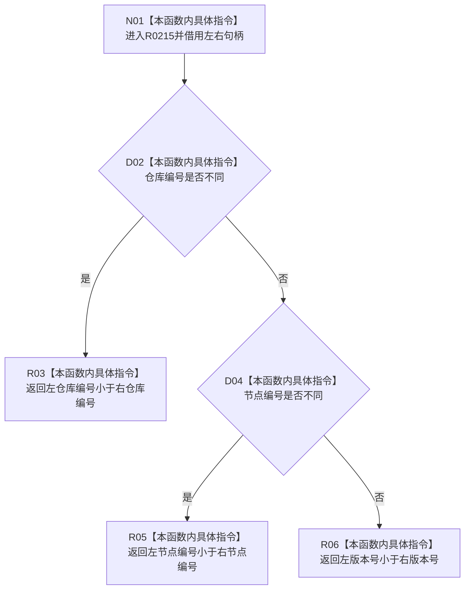

# CF-L11-0044 读取需求承接任务组排序 lambda 现状流程图

图类型：现状流程图
代码版本：`3920a74638264f9f539d50f32f3c9fe5fb1982ab`
源码 blob：`24161aaaf7138004380b42b37882149e7ff3a087`
覆盖文件：`海中鱼巣/领域/任务服务.h:494-502`
唯一根函数：R0215
完整签名：`bool 海中鱼巣::任务服务::读取需求承接任务组(海中鱼巣::节点句柄, const 海中鱼巣::状态服务&) const::<lambda@任务服务.h:494>::operator()(const 海中鱼巣::节点句柄& 左, const 海中鱼巣::节点句柄& 右) const`
参数：左右节点句柄均以 const 引用借用
返回结果：左句柄按仓库编号、节点编号、版本号字典序小于右句柄时返回 true
已登记调用方：RCE0767（R0214 的 `std::sort` 回调）
直接项目函数：无
外部边界：无；误归属的 X01869 已停用，真实 `std::sort` 边界仍归 R0214/X01864；未解析项目调用：0
调用图：`流程图/主程序可达调用关系/01_main可达项目调用边表.md`
逐行映射表：`流程图/代码流程图/L11/CF-L11-0044_读取需求承接任务组排序lambda_逐行代码映射表.md`
偏差清单：无；X01869 已从聚合关系停用且不设替代 ID
依据：RCE0767 与当前源码
结构读取与写入：只读两个句柄字段
逻辑内返回：三层字典序比较均为正常返回
不得作为施工许可：是
不得宣称：排序顺序赋予任务业务优先级

## 流程图

## 当前边界

- 本函数只定义排序比较；`std::sort` 调用属于 R0214。
