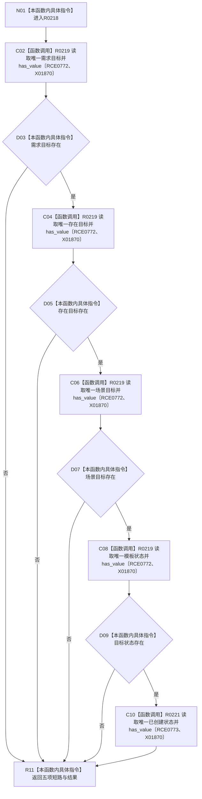

# CF-L11-0046 任务承接壳完整现状流程图

图类型：现状流程图
代码版本：`3920a74638264f9f539d50f32f3c9fe5fb1982ab`
源码 blob：`24161aaaf7138004380b42b37882149e7ff3a087`
覆盖文件：`海中鱼巣/领域/任务服务.h:726-732`
唯一根函数：R0218
完整签名：`bool 海中鱼巣::任务服务::任务承接壳完整(海中鱼巣::节点句柄 任务节点, const 海中鱼巣::状态服务& 状态) const`
参数：任务节点按值传入；状态服务以 const 引用借用
返回结果：需求、存在、场景、目标状态和创建状态五项均唯一存在时返回 true
已登记调用方：RCE0748、RCE0750、RCE0752、RCE0754、RCE0760、RCE0768、RCE0770
直接项目函数：R0219（RCE0772）、R0221（RCE0773）
外部边界：X01870；未解析项目调用：0
调用图：`流程图/主程序可达调用关系/01_main可达项目调用边表.md`
逐行映射表：`流程图/代码流程图/L11/CF-L11-0046_任务承接壳完整_逐行代码映射表.md`
偏差清单：无
依据：全部 7 条项目入边、RCE0772、RCE0773、X01870 与当前源码
结构读取与写入：只读任务关系与状态
逻辑内返回：任一项不存在时因短路返回 false
不得作为施工许可：是
不得宣称：壳完整证明任务可执行或已经完成

## 流程图

## 当前边界

- 使用短路与；前一项缺失时后续查询不执行。
