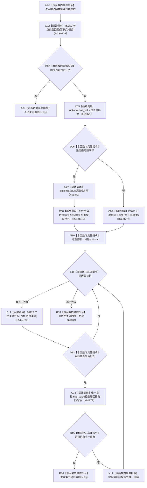

# CF-L11-0047 读取唯一目标四参数重载现状流程图

图类型：现状流程图
代码版本：`3920a74638264f9f539d50f32f3c9fe5fb1982ab`
源码 blob：`24161aaaf7138004380b42b37882149e7ff3a087`
覆盖文件：`海中鱼巣/领域/任务服务.h:738-757`
唯一根函数：R0220
完整签名：`std::optional<海中鱼巣::节点句柄> 海中鱼巣::任务服务::读取唯一目标(海中鱼巣::节点句柄 源节点, 海中鱼巣::关系类型 类型, 海中鱼巣::节点类型 目标类型, std::optional<std::int64_t> 顺序号) const`
参数：源节点、关系类型、目标类型按值传入；顺序号 optional 按值传入
返回结果：源节点类型不匹配、无匹配目标或存在多个匹配目标时返回 `nullopt`；恰一项时返回目标
已登记调用方：RCE0769（R0216）、RCE0771（R0217）、RCE0774（R0219）
直接项目函数：R0222（RCE0775）、F0620（RCE0776）、F0621（RCE0777）
外部边界：X01871、X01872、X01873；未解析项目调用：0
调用图：`流程图/主程序可达调用关系/01_main可达项目调用边表.md`
逐行映射表：`流程图/代码流程图/L11/CF-L11-0047_读取唯一目标四参数重载_逐行代码映射表.md`
偏差清单：无
依据：RCE0769、RCE0771、RCE0774—RCE0777、X01871—X01873 与当前源码
结构读取与写入：只读节点类型和关系目标组
逻辑内返回：源类型不匹配、零项或多项匹配均返回空 optional
不得作为施工许可：是
不得宣称：唯一目标存在证明目标合同或业务完成

## 流程图

## 当前边界

- 过滤条件是目标节点类型；匹配目标超过一项时不返回半结构。
