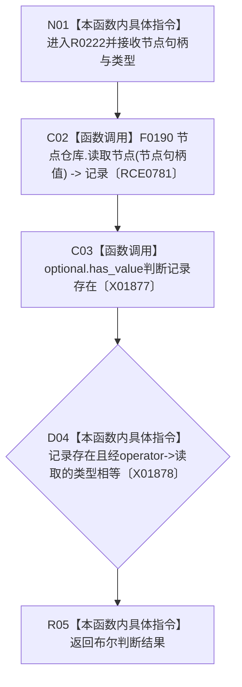

# CF-L11-0048 节点类型匹配现状流程图

图类型：现状流程图
代码版本：`3920a74638264f9f539d50f32f3c9fe5fb1982ab`
源码 blob：`24161aaaf7138004380b42b37882149e7ff3a087`
覆盖文件：`海中鱼巣/领域/任务服务.h:783-786`
唯一根函数：R0222
完整签名：`bool 海中鱼巣::任务服务::节点类型匹配(海中鱼巣::节点句柄 节点句柄值, 海中鱼巣::节点类型 类型) const`
参数：节点句柄和目标类型均按值传入
返回结果：节点记录存在且类型相等返回 true，否则返回 false
已登记调用方：RCE0756、RCE0758、RCE0763、RCE0775、RCE0778
直接项目函数：F0190（RCE0781）
外部边界：X01877、X01878；未解析项目调用：0
调用图：`流程图/主程序可达调用关系/01_main可达项目调用边表.md`
逐行映射表：`流程图/代码流程图/L11/CF-L11-0048_节点类型匹配_逐行代码映射表.md`
偏差清单：无
依据：全部 5 条项目入边、RCE0781、X01877、X01878 与当前源码
结构读取与写入：只读节点记录
逻辑内返回：节点不存在或类型不匹配时返回 false
不得作为施工许可：是
不得宣称：类型匹配证明节点其它字段或关系有效

## 流程图

## 当前边界

- 不存在和类型不匹配统一返回 false。
