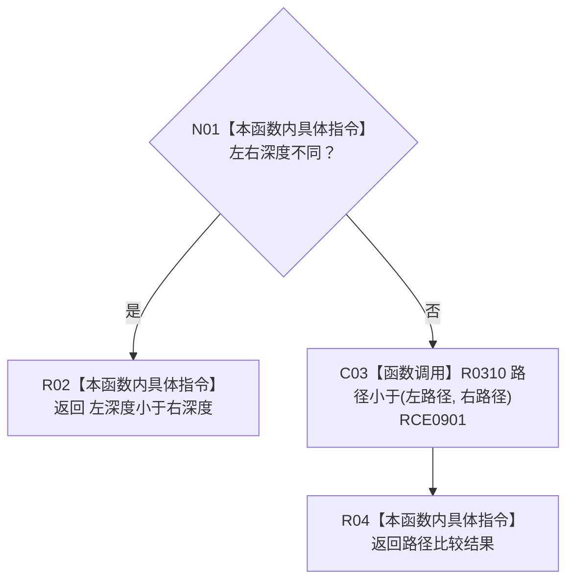

# CF-L11-0049 概念投影项排序比较现状流程图

图类型：现状流程图
代码版本：`3920a74638264f9f539d50f32f3c9fe5fb1982ab`
源码 blob：`b0b4cdc2cd7e7fd6801f36c7a43bc27595ca89d9`
覆盖文件：`海中鱼巣/领域/控制面板服务.h:1064-1069`
唯一根函数：R0280
完整签名：`bool 海中鱼巣::控制面板服务::转换概念树根(const 海中鱼巣::抽象树视图材料&, 海中鱼巣::控制面板请求状态&) const::<lambda@控制面板服务.h:1064>::operator()(const 海中鱼巣::抽象树投影项& 左, const 海中鱼巣::抽象树投影项& 右) const`
参数：左、右均为排序期间只读借用的抽象树投影项
返回结果：深度不同时按深度升序；深度相同时返回路径小于结果
已登记调用方：RCE0896 / RCB0007（R0279 的 `std::sort`）
直接项目函数：RCE0901 → R0310
外部边界：无；X02083 为误挂外层 `std::sort`，本批停用；未解析项目调用：0
逐行映射表：`流程图/代码流程图/L11/CF-L11-0049_概念投影项排序比较_逐行代码映射表.md`
依据：关系发布基线 `57c7ef1a4dc96083bd5ea570400c90cae5eaefc5` 与冻结源码
结构读写：只读两个投影项
不得作为施工许可：是
不得宣称：比较函数验证了投影项路径结构有效

## 流程图

## 当前边界

- `std::sort` 属于 R0279 的外部调用，不属于本比较 lambda。
