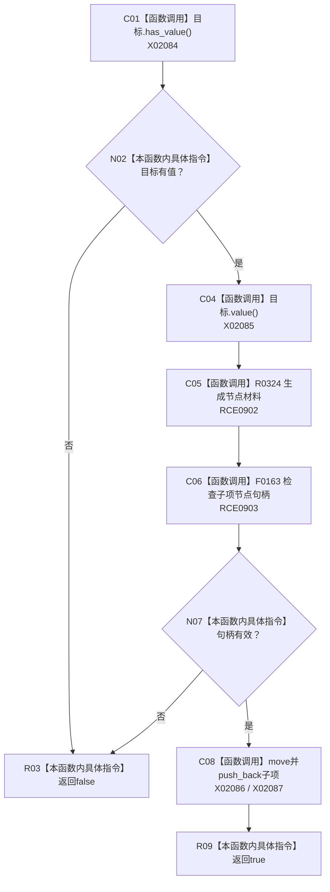

# CF-L11-0050 追加节点叶项可选目标现状流程图

图类型：现状流程图
代码版本：`3920a74638264f9f539d50f32f3c9fe5fb1982ab`
源码 blob：`b0b4cdc2cd7e7fd6801f36c7a43bc27595ca89d9`
覆盖文件：`海中鱼巣/领域/控制面板服务.h:1185-1198`
唯一根函数：R0281
完整签名：`bool 海中鱼巣::控制面板服务::追加节点叶项(控制面板树节点材料& 父节点, const std::optional<节点句柄>& 目标, 控制面板树关系角色 角色) const`
参数：父节点为可写借用；目标为只读可选句柄；角色按值传入
返回结果：目标缺失或生成句柄无效时返回假；追加成功时返回真
已登记调用方：RCE0904、RCE0926、RCE0948、RCE0962
直接项目函数：RCE0902 → R0324；RCE0903 → F0163
外部边界：X02084—X02087；未解析项目调用：0
逐行映射表：`流程图/代码流程图/L11/CF-L11-0050_追加节点叶项可选目标_逐行代码映射表.md`
依据：关系发布基线 `57c7ef1a4dc96083bd5ea570400c90cae5eaefc5` 与冻结源码
结构读写：只向调用方提供的局部父节点材料追加子项
不得作为施工许可：是
不得宣称：追加局部材料写入了权威树结构

## 流程图

## 当前边界

- 返回假前不修改父节点；追加只发生在句柄有效分支。
