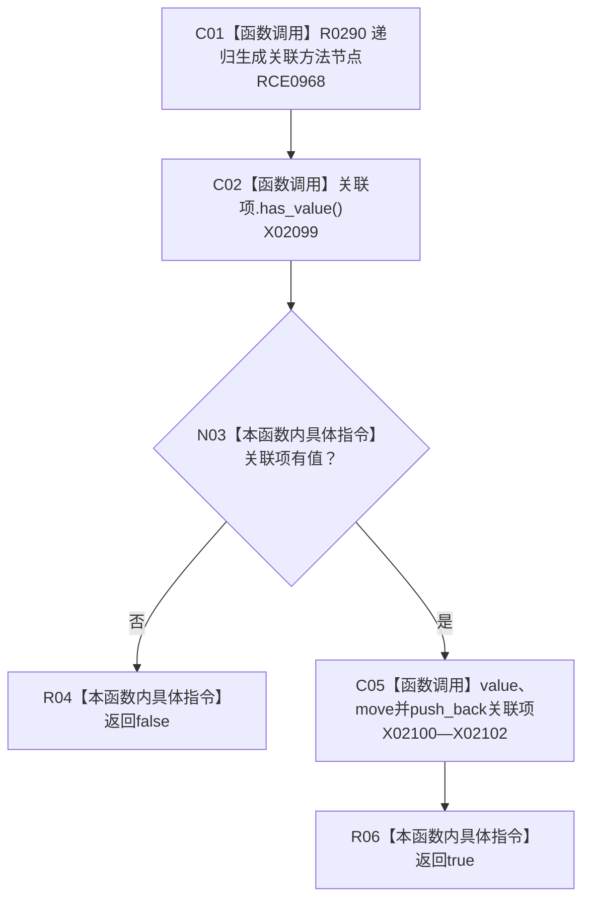

# CF-L11-0051 追加关联方法现状流程图

图类型：现状流程图
代码版本：`3920a74638264f9f539d50f32f3c9fe5fb1982ab`
源码 blob：`b0b4cdc2cd7e7fd6801f36c7a43bc27595ca89d9`
覆盖文件：`海中鱼巣/领域/控制面板服务.h:1566-1573`
唯一根函数：R0291
完整签名：`bool 海中鱼巣::控制面板服务::生成方法节点(海中鱼巣::节点句柄, 海中鱼巣::控制面板树关系角色, std::vector<海中鱼巣::节点句柄>&, 海中鱼巣::控制面板请求状态&, std::size_t) const::<lambda@控制面板服务.h:1566>::operator()(海中鱼巣::节点句柄 关联方法, 海中鱼巣::控制面板树关系角色 角色) const`
参数：关联方法和角色按值传入；捕获根、路径、状态和深度预算
返回结果：递归生成失败时返回假；移动追加关联项后返回真
已登记调用方：RCE0967（R0290）
直接项目函数：RCE0968 → R0290
外部边界：X02099—X02102；未解析项目调用：0
逐行映射表：`流程图/代码流程图/L11/CF-L11-0051_追加关联方法_逐行代码映射表.md`
依据：关系发布基线 `57c7ef1a4dc96083bd5ea570400c90cae5eaefc5` 与冻结源码
结构读写：只向捕获的局部根材料追加递归生成项
不得作为施工许可：是
不得宣称：追加成功证明关联方法没有其它结构问题

## 流程图

## 当前边界

- 递归状态由捕获的 `状态` 引用承载，本 lambda 不覆盖失败状态。
