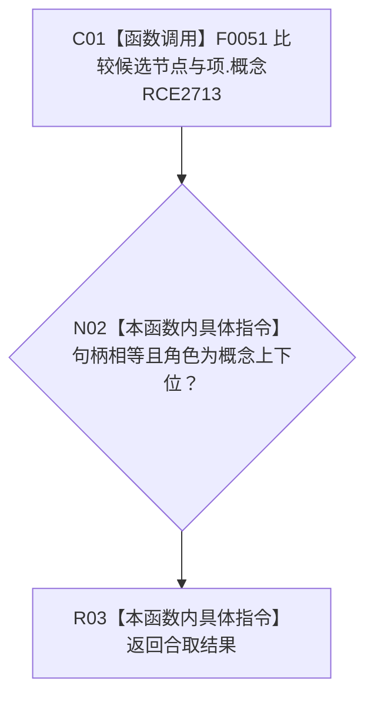

# CF-L11-0053 概念子项重复检测谓词现状流程图

图类型：现状流程图
代码版本：`3920a74638264f9f539d50f32f3c9fe5fb1982ab`
源码 blob：`b0b4cdc2cd7e7fd6801f36c7a43bc27595ca89d9`
覆盖文件：`海中鱼巣/领域/控制面板服务.h:1120-1123`
唯一根函数：R0792
完整签名：`bool 海中鱼巣::控制面板服务::转换概念树根(const 海中鱼巣::抽象树视图材料&, 海中鱼巣::控制面板请求状态&) const::<lambda@控制面板服务.h:1120>::operator()(const 海中鱼巣::控制面板树节点材料& 候选) const`
参数：候选为只读借用；捕获当前投影项
返回结果：候选节点等于投影概念且角色为概念上下位时返回真
已登记调用方：RCE2712 / RCB0041（R0279 的 `std::any_of`）
直接项目函数：RCE2713 → F0051
外部边界：无；未解析项目调用：0
逐行映射表：`流程图/代码流程图/L11/CF-L11-0053_概念子项重复检测谓词_逐行代码映射表.md`
依据：关系发布基线 `57c7ef1a4dc96083bd5ea570400c90cae5eaefc5` 与冻结源码
结构读写：只读候选与当前投影项
不得作为施工许可：是
不得宣称：未命中证明整棵概念树无重复

## 流程图

## 当前边界

- 谓词只检查当前父节点的一层子节点。
