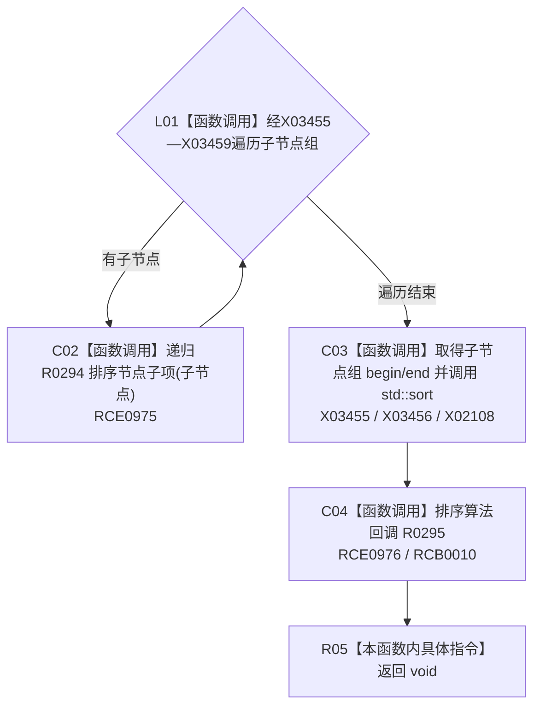

# CF-L11-0054 排序节点子项现状流程图

图类型：现状流程图
代码版本：`3920a74638264f9f539d50f32f3c9fe5fb1982ab`
源码 blob：`b0b4cdc2cd7e7fd6801f36c7a43bc27595ca89d9`
覆盖文件：`海中鱼巣/领域/控制面板服务.h:1659-1676`
唯一根函数：R0294
完整签名：`static void 海中鱼巣::控制面板服务::排序节点子项(控制面板树节点材料& 节点材料)`
参数：节点材料以可写引用借用
返回结果：`void`；递归排序全部后代后稳定比较当前子节点组
已登记调用方：R0294（RCE0975）、R0296（RCE0978）
直接项目函数：R0294（RCE0975）、R0295（RCE0976；RCB0010）
外部边界：X02108；X03455—X03459
逐行映射表：`流程图/代码流程图/L11/CF-L11-0054_排序节点子项_逐行代码映射表.md`
依据：冻结源码、既有项目边与符号外部边界
结构读写：原位重排当前节点及全部后代的子节点组
不得作为施工许可：是
不得宣称：排序会去重或改写节点业务字段

## 流程图

## 当前边界

- R0295 只在 `std::sort` 内作为比较回调执行，当前函数不直接解释其内部比较分支。
