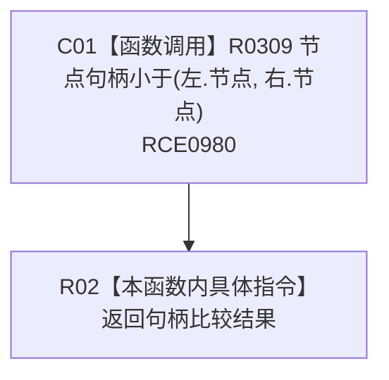

# CF-L11-0055 树根排序比较现状流程图

图类型：现状流程图
代码版本：`3920a74638264f9f539d50f32f3c9fe5fb1982ab`
源码 blob：`b0b4cdc2cd7e7fd6801f36c7a43bc27595ca89d9`
覆盖文件：`海中鱼巣/领域/控制面板服务.h:1682-1684`
唯一根函数：R0297
完整签名：`bool 海中鱼巣::控制面板服务::排序树结构(海中鱼巣::控制面板树结构材料&)::<lambda@控制面板服务.h:1682>::operator()(const 海中鱼巣::控制面板树节点材料& 左, const 海中鱼巣::控制面板树节点材料& 右) const`
参数：左右根节点材料以 const 引用借用
返回结果：返回左节点句柄是否小于右节点句柄
已登记调用方：R0296（RCE0979；RCB0011）
直接项目函数：R0309（RCE0980）
外部边界：无；X02112 已建议停用
逐行映射表：`流程图/代码流程图/L11/CF-L11-0055_树根排序比较_逐行代码映射表.md`
依据：冻结源码、RCE0979、RCE0980、RCB0011
结构读写：无，只读比较
不得作为施工许可：是
不得宣称：比较器自身执行根节点排序

## 流程图

## 当前边界

- X02112 的调用位置属于外层 R0296 的 `std::sort`，实际已由 X02111 登记。
