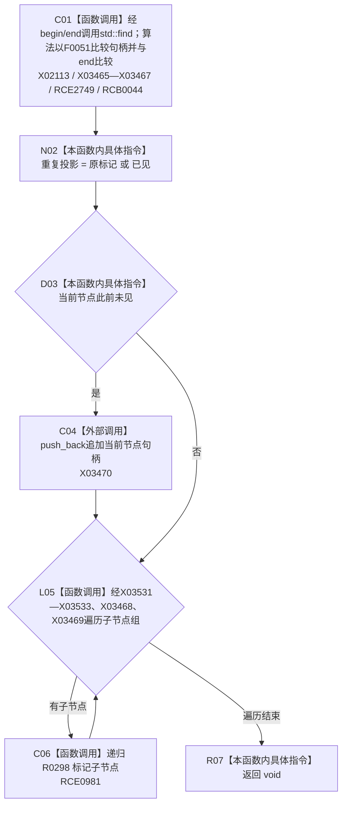

# CF-L11-0056 标记节点重复投影现状流程图

图类型：现状流程图
代码版本：`3920a74638264f9f539d50f32f3c9fe5fb1982ab`
源码 blob：`b0b4cdc2cd7e7fd6801f36c7a43bc27595ca89d9`
覆盖文件：`海中鱼巣/领域/控制面板服务.h:1687-1698`
唯一根函数：R0298
完整签名：`static void 海中鱼巣::控制面板服务::标记节点重复投影(控制面板树节点材料& 节点材料, std::vector<节点句柄>& 已见节点组)`
参数：节点材料与已见节点组均以可写引用借用
返回结果：`void`；标记当前节点并递归处理后代
已登记调用方：R0298（RCE0981）、R0299（RCE0982）
直接项目函数：R0298（RCE0981）、F0051（RCE2749；RCB0044）
外部边界：X02113；X03465—X03470、X03531—X03533
逐行映射表：`流程图/代码流程图/L11/CF-L11-0056_标记节点重复投影_逐行代码映射表.md`
依据：冻结源码与既有递归边、符号外部边界
结构读写：写节点材料的重复投影标记，并在首次出现时追加节点句柄
不得作为施工许可：是
不得宣称：重复投影节点会被删除

## 流程图

## 当前边界

- 已见组贯穿整棵树递归调用，当前函数不建立新的局部去重集合。
