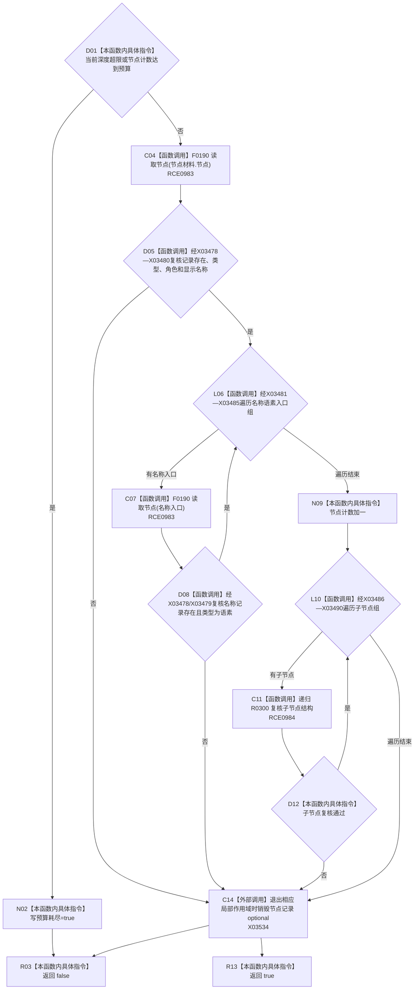

# CF-L11-0057 复核节点结构现状流程图

图类型：现状流程图
代码版本：`3920a74638264f9f539d50f32f3c9fe5fb1982ab`
源码 blob：`b0b4cdc2cd7e7fd6801f36c7a43bc27595ca89d9`
覆盖文件：`海中鱼巣/领域/控制面板服务.h:1707-1740`
唯一根函数：R0300
完整签名：`bool 海中鱼巣::控制面板服务::复核节点结构(const 控制面板树节点材料& 节点材料, std::size_t 当前深度, std::size_t 节点预算, std::size_t 深度预算, std::size_t& 节点计数, bool& 预算耗尽) const`
参数：节点材料只读借用；深度和预算按值；节点计数与预算耗尽以可写引用传入
返回结果：预算、节点记录、显示字段、名称语素入口和全部后代均有效时返回 `true`
已登记调用方：R0300（RCE0984）、R0301（RCE0985）
直接项目函数：F0190（RCE0983，两处）、R0300（RCE0984）
外部边界：X03478—X03490、X03534
逐行映射表：`流程图/代码流程图/L11/CF-L11-0057_复核节点结构_逐行代码映射表.md`
依据：冻结源码与既有项目边、符号外部边界
结构读写：只写调用方传入的节点计数和预算耗尽标记，不写仓库
不得作为施工许可：是
不得宣称：返回 false 一定表示预算耗尽

## 流程图

## 当前边界

- 节点记录和名称语素入口均逐项从节点仓库读取；本函数不信任树材料中的类型字段。
